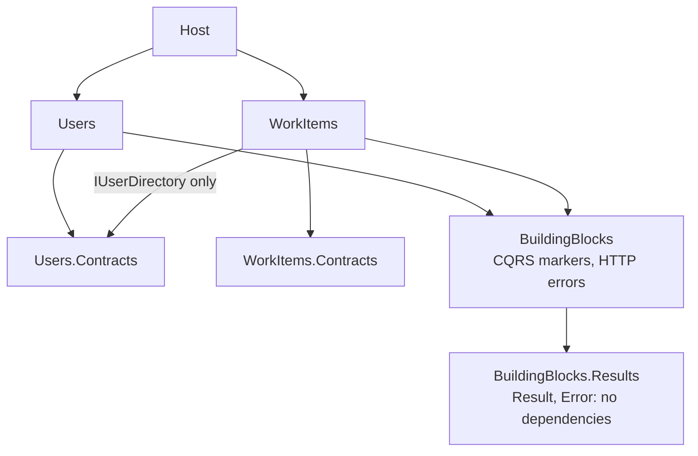
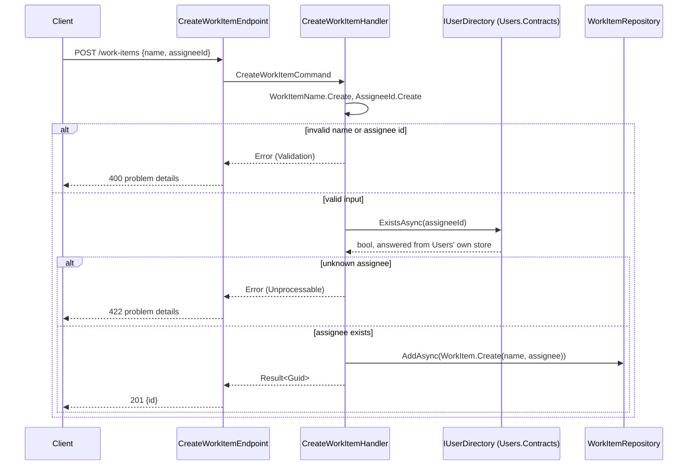

# Users & Work Items: a .NET 8 modular monolith

Two modules, **Users** and **WorkItems**, built with **FastEndpoints**, **CQRS** and **DDD**.
Four endpoints, one in-memory store per module, and module boundaries enforced by architecture tests.

## Quick start

```bash
dotnet build                          # warnings are errors
dotnet test                           # 87 tests: architecture, domain, handler, API
dotnet run --project src/Host         # http://localhost:5000
```

- Swagger UI: <http://localhost:5000/swagger>
- [`requests.http`](requests.http) walks through all four endpoints, plus one error case each (VS Code REST Client, Visual Studio, Rider).
- Needs the .NET 8 runtime; any .NET 8+ SDK builds it. Data is in-memory and resets on restart.

## Architecture at a glance



- **A module is two projects:** an implementation, whose `Domain/ Application/ Infrastructure/ Endpoints/` are folders of `internal` types, and a public `*.Contracts` project. The only public type in an implementation is its `XModule` class, whose `AddXModule()` registers the module.
- **Each module owns its data:** its own `DbContext` and schema. There are no cross-module joins or foreign keys; a work item stores its assignee as a plain id.
- **One cross-module call:** WorkItems asks `IUserDirectory.ExistsAsync(Guid)` from `Users.Contracts`, in-process and synchronously. The contract takes a plain `Guid`, so no Users type crosses the boundary.

## How a request flows

- **Command:** endpoint → `*Command` → handler → value objects and aggregate → repository → `DbContext`. Returns `Result<Guid>`: at most an id.
- **Query:** endpoint → `*Query` → handler → read store (no tracking, projected straight to DTOs) → DTO. The aggregate is never loaded.
- **Errors:** value objects and handlers return an `Error` (Validation, NotFound, Conflict or Unprocessable) instead of throwing. One helper sends it as RFC 7807 problem details (400, 404, 409 or 422) with a stable `code`, such as `users.username.taken`.

The one request that crosses modules:



## Key decisions and trade-offs

Every decision, with the options considered, is in [`ai-journey/decisions.md`](ai-journey/decisions.md) (numbers in brackets).

| Decision | Chosen | Trade-off accepted |
|---|---|---|
| Project layout [#9] | Implementation + Contracts per module, layers as `internal` folders | Layering is enforced by tests, not the compiler |
| CQRS dispatch [#10] | FastEndpoints command bus with our own `ICommand`/`IQuery` markers | The Application layer depends on FastEndpoints. Avoids MediatR's commercial license and Mediator's need for public handlers |
| Assignee check [#2, #23] | Synchronous call through the contract | Runtime coupling, versus integration events and a local read model in WorkItems |
| Unknown user in list [#3] | `200 []` | Callers can't tell "no such user" from "no items"; reads stay inside WorkItems |
| Read side [#14, #20] | One read-store interface per query, implemented in Infrastructure | One small interface per read use case |
| Validation [#13] | Value objects only; no FluentValidation duplicates | Errors come back one at a time; request records allow nulls so missing values reach the domain |
| Errors [#5] | `Result` + problem details | A small Result type instead of exceptions for expected failures |
| Persistence [#6, #12] | EF Core InMemory, one store per module | No real unique constraint, so the username uniqueness check is check-then-insert and not race-safe. The unique index already in the model would close this on SQL |

## What the tests enforce

- **Architecture (`tests/Architecture.Tests`, NetArchTest):**
  - modules reach each other only through Contracts;
  - Contracts reference only the base class library;
  - only the `XModule` class is public;
  - the domain uses no framework, and `BuildingBlocks.Results` has no dependencies;
  - layer direction (Endpoints → Application → Domain; Infrastructure implements the ports);
  - CQRS rules: `*Command`/`*Query` naming, commands return only an id, query handlers never use repositories.

  Every rule was first shown failing against a deliberate violation.
- **Domain and handlers:** value-object and aggregate invariants. WorkItems handler tests replace the Users module with a fake of `IUserDirectory`; the test project references only `Users.Contracts`, never the Users implementation.
- **API (`WebApplicationFactory`):** every endpoint end to end, including errors and both modules together, plus the documented OpenAPI contract.

## With more time

- Replace the synchronous assignee check with a `UserCreated` integration event (with an outbox) and a local read model of users in WorkItems.
- A real database: SQL with migrations, a schema per module, and the unique username index enforced. Push list sorting into the query and add paging.
- A `CreatedAt` field (with an injectable clock) so lists can be newest-first.
- Upgrade to .NET 10 LTS (.NET 8 support ends on 2026-11-10).
- Users handler tests, and a shared result-to-response helper once there are more than a handful of endpoints.

## AI journey

How this was built with Claude Code is in [`ai-journey/`](ai-journey/README.md). It covers:

- the approved plans and every decision, with my overrides;
- the prompts, the toolchain, and where the AI was wrong;
- an independent AI review of the code and how its findings were triaged.
