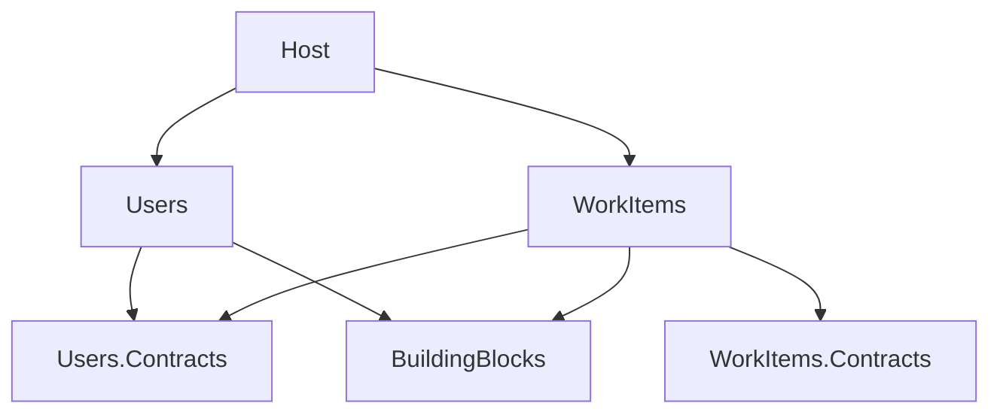

# Plan

Curated plan I worked from. New revisions are appended as dated sections; earlier
sections are never edited. Verbatim snapshots of each approved plan: [`plans/`](./plans/).

<!-- Claude appends approved plans below -->

---

## 2026-10-07 — Architecture plan (approved)


## Context
This is a take-home for a Senior Backend role. It is a .NET 8 modular monolith using FastEndpoints, CQRS and DDD, with two modules: Users and WorkItems. It is judged on module boundaries, DDD, a clean CQRS split, thin endpoints, testability, clarity and the ai-journey, not on how many features it has. The repo is greenfield: no .NET code exists yet. Every choice below was already confirmed with the user and logged in `ai-journey/decisions.md` as decisions #1–#16. This plan turns those choices into a structure and a build order.

Environment: SDK 10.0.4xx plus the .NET 8.0.30 runtime are installed. All projects target `net8.0` through `Directory.Build.props`. No `global.json` pin, because SDK 8 is not installed. Worth noting for the README: .NET 8 support ends on 2026-11-10.

---

## 1. Solution layout (decision #9: Module + Contracts)

```
JTL-BE.sln
Directory.Build.props            net8.0, nullable, implicit usings, TreatWarningsAsErrors
src/
  Host/                          Program.cs: AddFastEndpoints, AddUsersModule, AddWorkItemsModule, SwaggerDoc
  BuildingBlocks/                Result/Result<T>, Error(Code, Message, Kind), ICommand<T>/IQuery<T> markers,
                                 Result→ProblemDetails mapping helper for endpoints
  Modules/
    Users/
      Users.Contracts/           public: IUserDirectory
      Users/                     everything internal except UsersModule
        Domain/                  User, UserId, Username, IUserRepository
        Application/             CreateUser/ (command+handler), GetUserById/ (query+handler+UserDto)
        Infrastructure/          UsersDbContext, UserRepository, UserDirectory (implements contract)
        Endpoints/               CreateUserEndpoint, GetUserByIdEndpoint
        UsersModule.cs           public static AddUsersModule(this IServiceCollection)
    WorkItems/
      WorkItems.Contracts/       (empty for now; placeholder for future integration events)
      WorkItems/                 same shape: WorkItem, WorkItemId, WorkItemName, AssigneeId, ...
tests/
  Architecture.Tests/            NetArchTest boundary + layering + CQRS rules
  Users.Tests/                   domain unit tests (InternalsVisibleTo)
  WorkItems.Tests/               domain unit tests + handler test with fake IUserDirectory
  Api.Tests/                     WebApplicationFactory<Program> integration tests
http/requests.http               exercises the 4 endpoints
```

The `WorkItems.Contracts` project is created now, even though it is empty, so that the rule "a module is only reachable through its Contracts" is the same for both modules. The alternative is to drop it until something needs it, which saves a project but makes the layout inconsistent. **Recommendation: keep it, with a one-line README note.**

### Allowed project references

These references are forbidden, and the architecture tests check for them:
- WorkItems → Users, and Users → WorkItems in any form (including WorkItems.Contracts, since nothing needs it).
- Contracts → module internals.
- Domain → Application, Infrastructure, Endpoints, EF Core or FastEndpoints.
- Application → Infrastructure or Endpoints.
Only the Host references module implementation projects.

## 2. Module boundaries and the cross-module check (decisions #2, #11)
- **Users.Contracts** exposes `IUserDirectory { Task<bool> ExistsAsync(Guid userId, CancellationToken ct); }`. It uses primitive `Guid` rather than the internal `UserId` type, so no domain type crosses a module boundary.
- **Users** implements it with `internal sealed class UserDirectory`, using `UsersDbContext.Users.AnyAsync(...)`, and registers it in `AddUsersModule`.
- **WorkItems** models its own `AssigneeId` value object. It is the WorkItems view of "who owns this", not a copy of `UserId`. `CreateWorkItemHandler` calls `IUserDirectory.ExistsAsync` and returns `Error.Unprocessable` (422) if the user is unknown.

| Option | Pros | Cons |
|---|---|---|
| **Sync in-process contract (chosen)** | Simple. Strongly consistent. Easy to fake in tests. The contract is explicit. | WorkItems needs Users to be available at runtime. A remote call would be needed if Users were ever extracted. |
| Integration events + local read model | Modules are decoupled in time. Extraction-ready. WorkItems works when Users is down. | Needs an outbox/dispatcher. Eventual consistency, so a user created a moment ago may be rejected. Too much for 2–4 h. |

The README will name the events approach as the next step if the modules are ever split apart.

## 3. Domain model
**Users**
- `UserId`: `readonly record struct UserId(Guid Value)` with `New()`.
- `Username`: a value object.
  - `Create(string)` returns `Result<Username>`: it trims the input, then requires 3–32 characters matching `^[a-zA-Z0-9._-]+$`.
  - It exposes `Value` (as entered) and `NormalizedValue` (upper-invariant, used for uniqueness).
- `User`: the aggregate root.
  - Private setters and a private EF constructor.
  - `static User Create(Username)` assigns a new `UserId`.
- Uniqueness (decision #12) lives in `CreateUserHandler`, using `IUserRepository.ExistsByUsernameAsync(Username)`. If the name is taken, the handler returns `Error.Conflict` (409). Known race: the InMemory provider doesn't enforce unique indexes. This is documented, and the EF model declares a unique index on `NormalizedValue` so a SQL provider gets it for free.

**WorkItems**
- `WorkItemId`, `AssigneeId`: record structs wrapping `Guid`.
- `WorkItemName`: trimmed, 1–200 characters, and not whitespace-only.
- `WorkItem`: the aggregate root, created with `static Create(WorkItemName, AssigneeId)`. It is immutable after creation, because no update use case exists.
- Cross-aggregate/cross-module rule: the assignee must exist. That check lives in the application layer, through `IUserDirectory`, not in the domain.

The domain has no domain events: nothing consumes them. The README will say where they would go.

## 4. CQRS (decisions #7, #10)
| Option | Pros | Cons |
|---|---|---|
| **FastEndpoints command bus (chosen)** | Already a dependency. Handlers can be `internal`. Supports command middleware. | It has no native concept of a query, so the split is our own markers plus an architecture test. The application layer depends on FastEndpoints. |
| Mediator (martinothamar, source-generated, MIT) | Native `ICommand`/`IQuery`. Fast. Keeps the application layer framework-independent. | One more dependency, and the generated code needs **public** handlers across assemblies. |
| MediatR | The most familiar option. | Commercially licensed since v13 (2025). v12 still works but is frozen. Not worth it for 4 handlers. |

The mechanics, in `BuildingBlocks`:
- `ICommand<TResult> : FastEndpoints.ICommand<TResult>` and `IQuery<TResult> : FastEndpoints.ICommand<TResult>`.
- Commands return `Result<Guid>`; queries return `Result<TDto>`.
- Endpoints call `await cmd.ExecuteAsync(ct)`.
- Architecture test: types ending in `Command` implement `ICommand<>`, types ending in `Query` implement `IQuery<>`, and query handlers don't depend on the repository interfaces (they read only).

Risk to check in slice 0: FastEndpoints must discover **internal** endpoints and handlers in module assemblies. If it doesn't, fall back to registering assemblies explicitly in `o.Assemblies` / `AddFastEndpoints(o => o.Assemblies = ...)`. If that also fails, make only the endpoint classes public and log it under Corrections.

## 5. Persistence (decisions #6, #14)
| Option | Pros | Cons |
|---|---|---|
| **EF Core InMemory, one DbContext per module (chosen)** | Module data ownership is visible. Moving to a real database is a provider swap. LINQ projections work for reads. | Unique constraints and transactions aren't enforced. |
| Hand-rolled `ConcurrentDictionary` repositories | No dependencies, transparent. | Unrealistic, and querying has to be hand-written. |

- `UsersDbContext` / `WorkItemsDbContext` are internal. Each module sets a default schema (`users` / `work_items`) and uses its own InMemory database name, so a SQL swap gets schema-per-module.
- Value objects and IDs are mapped with EF value converters (`HasConversion`).
- Writes go through the domain-defined `IUserRepository` / `IWorkItemRepository`, implemented in Infrastructure, with `SaveChanges` inside the repository's `AddAsync`. There is no separate unit of work, because each command touches one aggregate.
- Reads: query handlers use the DbContext directly, with `AsNoTracking` plus a `Select` projection to a DTO.
- Swapping providers means changing one `UseInMemoryDatabase` call per `AddXModule`.

## 6. HTTP contract (decisions #3, #5, #13, #15, #16)
| Endpoint | Success | Failures |
|---|---|---|
| `POST /users` `{ "username" }` | 201, `Location: /users/{id}`, `{ "id" }` | 400 invalid username · 409 duplicate |
| `GET /users/{id}` | 200 `{ "id", "username" }` | 404 |
| `POST /work-items` `{ "name", "assigneeId" }` | 201, `{ "id" }` | 400 invalid name or malformed GUID · 422 unknown assignee |
| `GET /work-items?assigneeId={id}` | 200 `[{ "id", "name", "assigneeId" }]` (possibly empty) | 400 if missing or malformed |

How errors flow:
- All failures are RFC 7807 ProblemDetails, using FastEndpoints `UseProblemDetails()`.
- Value objects return `Error.Validation(field, message)`, which becomes a 400 with an `errors` map.
- `Error.NotFound` → 404, `Error.Conflict` → 409, `Error.Unprocessable` → 422.
- One `BuildingBlocks` extension maps `Result` to these responses, so each endpoint stays at about 3 lines: map the request, execute, map the result.
- Request-shape validation (required fields, GUID binding) is left to FastEndpoints model binding; there are no FluentValidation rule copies.

## 7. Testing (decision #8)
- **Architecture.Tests** (NetArchTest.Rules, xUnit) checks:
  - Modules don't reference each other's internals.
  - Contracts don't depend on implementations.
  - Domain has no dependency on EF Core, FastEndpoints or Application.
  - Application doesn't depend on Infrastructure or Endpoints.
  - The Command/Query naming and marker rules hold.
  - Domain types are not public.
- **Users.Tests / WorkItems.Tests** (xUnit + FluentAssertions 7.x, which is Apache-licensed; v8 is commercial):
  - Value-object rules (good and bad inputs) and aggregate factories.
  - In WorkItems, one `CreateWorkItemHandler` test with a fake `IUserDirectory` that returns false, expecting a 422 error.
- **Api.Tests** (`Microsoft.AspNetCore.Mvc.Testing`, `WebApplicationFactory<Program>`):
  - Users: create, then get by id, then a duplicate gives 409.
  - WorkItems: create a user, create a work item, list by assignee. Plus: an unknown assignee gives 422, and an unknown user's list is empty.
  - Each test gets its own factory or database name, so tests stay isolated.

## 8. Vertical slices (each must end with `dotnet build` + `dotnet test` green, then a suggested commit)
0. **Skeleton**:
   - Solution, `Directory.Build.props`, Host, BuildingBlocks (Result/Error/markers/mapping), empty module projects and test projects.
   - One architecture test for the project-reference rules.
   - Verify that internal endpoint discovery works.
   - Suggested commit: `chore: scaffold modular monolith skeleton`.
1. **Users: create user**:
   - `Username` + `User` + domain tests.
   - Repository + DbContext, handler with the uniqueness check, endpoint, API test (201/400/409).
   - Suggested commit: `feat(users): create user`.
2. **Users: get by id**:
   - Query + read projection + endpoint, API test (200/404).
   - Suggested commit: `feat(users): get user by id`.
3. **Users contract**:
   - `IUserDirectory` + internal implementation + DI registration.
   - Suggested commit: `feat(users): expose user directory contract`.
4. **WorkItems: create**:
   - VOs + aggregate + domain tests, handler using `IUserDirectory` + handler test, endpoint, API test (201/400/422).
   - Suggested commit: `feat(work-items): create work item`.
5. **WorkItems: list by assignee**:
   - Query + endpoint + API test (200 list, 200 empty, 400).
   - Suggested commit: `feat(work-items): list by assignee`.
6. **Architecture rules complete**: layering, CQRS markers and visibility tests. Suggested commit: `test(arch): enforce layering and CQRS rules`.
7. **Docs**: README (decisions, flow diagram, run instructions, "with more time"), `requests.http`, Swagger, ai-journey curation. Suggested commit: `docs: readme and http samples`.

## 9. Deliberately left out
- Auth.
- Logging/metrics.
- CI.
- Docker.
- Outbox and integration events.
- Domain events.
- Pagination on the list endpoint.
- Optimistic concurrency.
- A real database and migrations.
- Update/delete use cases.
- MediatR-style pipeline behaviours (validation, transactions).
- Versioned API.
- Exhaustive tests.

The README's "with more time" section covers: events + read model, unique index with SQL/Postgres, pagination, and an upgrade to .NET 10 LTS.

## Verification
- `dotnet build`: zero warnings (warnings are treated as errors).
- `dotnet test`: architecture, domain, handler and API suites all green.
- `dotnet run --project src/Host`, then run `http/requests.http` (or use Swagger at `/swagger`) to hit all 4 endpoints, including the 400/404/409/422 paths.
- After approval: append this plan verbatim to `ai-journey/plan.md` as a dated section.
