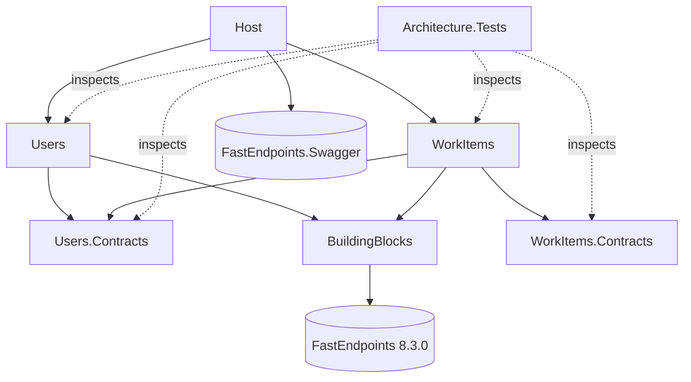

# Session 8afeacf8

_Auto-exported by save-transcript.mjs. Raw JSONL alongside._

---

## 🧑 Me


<pasted_content id="8051">
Read README.md and senior-backend-engineer/instructions.md, then CLAUDE.md.
Do not write any code yet.

1. Summarise the task as: must-have requirements, evaluation criteria, explicit non-goals,
   and submission deliverables (incl. ai-journey).
2. Identify every ambiguity or open design question yourself. Think about at least:
   username rules and uniqueness, whether the assignee must exist, behaviour of
   "list work items" for an unknown user, ID type, error/response contract, persistence.
3. Ask me about them with AskUserQuestion, max 4 per batch. For each question give 2–3 options
   with trade-offs and mark your recommended default.
4. After I answer, log each decision in ai-journey/decisions.md (AI proposed vs. final).
5. Finally, draft a short message I can send to the hiring contact with the 2–3 questions
   that genuinely need THEIR answer (not mine), stating the default I'll assume meanwhile.
</pasted_content id="8051">


**🤖 Claude:**


_tools: Bash_

**🤖 Claude:**


_tools: AskUserQuestion_

**🤖 Claude:**

The second batch covers technical choices.

**🤖 Claude:**


_tools: AskUserQuestion_

**🤖 Claude:**


_tools: Edit_

**🤖 Claude:**


_tools: Edit_

**🤖 Claude:**

I asked 8 open questions in two batches and you accepted my recommended option on all of them. Each one is logged in `ai-journey/decisions.md`, rows 1–8, with the options, my proposal and your final choice. None were overrides.

I also added a "Hiring contact message" section at the bottom of that file. When you send the message below, fill in the send date there, and later their answer. If they choose something other than my default, it goes under "Corrections". No code has been written.

## Draft message to the hiring contact

These are the three questions that are product or API behaviour rather than design choices. The other five (ID type, error format, persistence, CQRS library, tests) are yours to decide and explain in the README.

> **Subject:** Senior Backend take-home: 3 quick clarifying questions
>
> Hi [Name],
>
> I've started on the backend take-home. Before I go further, three questions about intended behaviour. I'll go ahead with the default in brackets for now, so there's no rush:
>
> 1. **Username uniqueness:** Should usernames be unique, and if so, case-insensitively ("Alice" and "alice" count as the same user)?
>    *(Default: unique and case-insensitive, 3–32 characters, letters/digits/`._-`.)*
> 2. **Assignee existence:** When creating a work item, should the service reject an assignee user ID that doesn't exist? Or are work items allowed to reference users that don't exist yet?
>    *(Default: reject it. The WorkItems module checks through the Users module's public contract.)*
> 3. **Listing for an unknown user:** When retrieving work items for a user ID that doesn't exist, should the API return an empty list or a 404?
>    *(Default: 200 with an empty list, so the read side doesn't depend on the Users module.)*
>
> Thanks!
> [Your name]

The next step is the architecture and solution-layout plan (projects, folders, how the contracts are wired). Shall I start that?

---

## 🧑 Me


<pasted_content id="8051">
Propose the architecture for this modular monolith. Do not write code.

Cover:
- Solution/project layout and the allowed project reference graph (draw it as a list or mermaid).
- Module boundaries: what each module's Contracts exposes, and how WorkItems validates an
  assignee without depending on Users internals. Compare a synchronous in-process contract
  vs. integration events + local read model.
- Domain model per module: aggregates, value objects, strongly-typed IDs, invariants, and
  where cross-aggregate rules (e.g. username uniqueness) live.
- CQRS: compare the FastEndpoints built-in command bus, the Mediator (source-generated) library,
  and MediatR (note its current licensing). Recommend one for this task and justify.
- Persistence: per-module store, in-memory option, and how it stays swappable.
- Request/response and error contract (status codes, validation, problem details).
- Testing strategy: domain unit tests, architecture tests for boundaries, a few endpoint
  integration tests. Name the libraries.
- Implementation order as vertical slices, each ending green.
- What we deliberately leave out (time box 2–4h).

For every major decision give 2 options + trade-offs + your recommendation.
Ask me (AskUserQuestion) about anything where reasonable seniors would disagree.
</pasted_content id="8051">


**🤖 Claude:**


_tools: Bash_

**🤖 Claude:**


_tools: Bash_

**🤖 Claude:**

Before I write the plan, these are the points where experienced engineers would reasonably disagree. First batch:

**🤖 Claude:**


_tools: AskUserQuestion_

**🤖 Claude:**

Second batch, covering the API surface and the internals of the read and write sides:

**🤖 Claude:**


_tools: AskUserQuestion_

**🤖 Claude:**


_tools: Edit_

**🤖 Claude:**


_tools: ToolSearch_

**🤖 Claude:**


_tools: EnterPlanMode_

**🤖 Claude:**


_tools: Write_

**🤖 Claude:**


_tools: Edit_

**🤖 Claude:**


_tools: ExitPlanMode_

**🤖 Claude:**

Approved. Saving it verbatim to `ai-journey/plan.md` as the working agreement requires:

**🤖 Claude:**


_tools: Bash_

**🤖 Claude:**


_tools: Bash_

**🤖 Claude:**

I've written up the architecture plan and you approved it. It's now appended word for word to `ai-journey/plan.md` as a section dated 2026-10-07. No code has been written yet.

**What the plan settles:**
- **Layout:** each module is two projects, a public `*.Contracts` project and one module project. Inside that project, Domain, Application, Infrastructure and Endpoints are folders, and everything is `internal`.
- **Cross-module check:** WorkItems asks Users whether an assignee exists through `IUserDirectory` in `Users.Contracts`. It passes a plain `Guid`, so no domain type crosses the boundary. WorkItems has its own `AssigneeId` value object.
- **CQRS:** FastEndpoints' built-in command bus, with our own `ICommand`/`IQuery` markers. An architecture test enforces the split.
- **Persistence:** EF Core in-memory, one DbContext per module. Writes go through repositories; reads query the DbContext directly.
- **HTTP:** errors are ProblemDetails: 400 for bad input, 404 not found, 409 duplicate username, 422 unknown assignee. Listing is `GET /work-items?assigneeId=`.
- **Build order:** 8 vertical slices, each ending with a green build and tests and a suggested commit message.

**Decisions:** you made 8 new ones (#9–#16) across two question batches and accepted my recommendation each time. They're in `ai-journey/decisions.md`, next to #1–#8 from the earlier phase.

**Things to know:**
- **The plan-snapshot hook saved nothing.** `ai-journey/plans/` was never created. `.claude/hooks/save-plan.mjs` reads `tool_input.plan`, but in this Claude Code version ExitPlanMode takes no input and reads the plan from a file instead, so the hook found nothing and quietly exited. One fix is to fall back to `tool_response`, or to read the newest file in `~/.claude/plans/`. Since that's your hook, I haven't touched it. Want me to patch it and back-fill `plans/01_*.md`?
- **.NET 8 support ends on 2026-11-10**, about a month from now. The stack is fixed, so I'll just mention it under "with more time" in the README. Building with SDK 10 for `net8.0` works, and the 8.0.30 runtime is installed.
- **Not yet confirmed in practice: whether FastEndpoints picks up `internal` endpoints and handlers.** Slice 0 checks this first. The plan has a fallback, and if it's needed I'll log it under Corrections.

The next step is slice 0, the solution skeleton plus the first architecture test. Shall I start?

---

## 🧑 Me

Append the approved plan to ai-journey/plan.md and log the decisions in ai-journey/decisions.md.

**🤖 Claude:**


_tools: Bash_

**🤖 Claude:**

Both were already done last turn, so I didn't append them again. One small fix: the "Where I overrode the AI" note only mentioned the requirements phase, so I've added the architecture phase to it.

**🤖 Claude:**


_tools: Edit_

**🤖 Claude:**

Both were already saved last turn, and I checked them again now:

- **`ai-journey/plan.md`**: the approved plan is in there once, as the section "2026-10-07 — Architecture plan (approved)". It's word for word the same as the approved plan file, apart from the title line and one blank line.
- **`ai-journey/decisions.md`**: all 16 decisions are logged, the 8 requirements decisions and the 8 architecture ones. Each row has the options, my recommendation, your final choice and whether you overrode me. You didn't override any.

The one new change is in the "Where I overrode the AI" note. It now covers both phases and says that #10 reopened the CQRS library choice (#7) once Mediator was compared, and the original pick stayed.

The plan-snapshot hook still isn't writing anything to `ai-journey/plans/`. Should I fix it and back-fill the snapshot of this plan, or move on to slice 0, the solution skeleton?

---

## 🧑 Me

Fix the hook and back-fill the snapshot

**🤖 Claude:**


_tools: Bash_

**🤖 Claude:**


_tools: Bash_

**🤖 Claude:**


_tools: Bash_

**🤖 Claude:**

The ExitPlanMode result carries `{ plan, filePath }`, which the hook receives as `tool_response`. I'll update the hook to read it from there.

**🤖 Claude:**


_tools: Read_

**🤖 Claude:**


_tools: Edit_

**🤖 Claude:**

Now I'll test the fixed hook against the real ExitPlanMode payload from the transcript, writing into a scratch directory so nothing in the repo changes:

**🤖 Claude:**


_tools: Bash_

**🤖 Claude:**


_tools: Bash_

**🤖 Claude:**

Logging it under Corrections, as the honesty rule requires:

**🤖 Claude:**


_tools: Edit_

**🤖 Claude:**


_tools: Edit_

**🤖 Claude:**

I fixed the plan-snapshot hook and back-filled the missing snapshot as `ai-journey/plans/01_2026-10-07_2136.md`.

**The bug:** `.claude/hooks/save-plan.mjs` looked for the plan in `tool_input.plan`. In this Claude Code version (2.1.292), ExitPlanMode takes no input and returns the plan in its result (`tool_response`, with `plan` and `filePath`). The hook found nothing and exited without a word.

**The fix:** the hook now looks in three places, in order: `tool_input.plan`, `tool_response.plan`, then the file at `tool_response.filePath`. If none has a plan, it writes a warning to stderr instead of failing silently. It still always exits 0, so it can't block a session.

**How I tested it:** I replayed the real ExitPlanMode result from this session's transcript into the hook, writing to a scratch directory. The snapshot it produced matched the approved plan apart from a trailing newline. An empty payload gave the warning and exit 0. The real test is the next time a plan is approved, when a `02_*.md` should appear.

**The back-filled snapshot** was rebuilt from that same transcript record, so it's the exact approved text. It uses the hook's file-name format, but its header says it was back-filled and gives the original approval time, 21:36 local. That way it doesn't pretend the hook saved it.

**Logged as Correction #1** in `ai-journey/decisions.md`: what was wrong, how it was noticed, the fix and how it was checked.

Suggested commit message, if you want to commit this before slice 0 (I haven't committed):
```
fix(ai-journey): read approved plan from ExitPlanMode tool_response
```

---

## 🧑 Me


<pasted_content id="8051">
Implement step 1 of the plan only: solution, projects, project references, shared building
blocks, the host wired with FastEndpoints + Swagger, and an empty architecture-test project
with a first passing boundary test. Then fill in the Commands section of CLAUDE.md.
Run dotnet build and dotnet test. Stop and show me the project reference graph.
Suggest a commit message.
</pasted_content id="8051">


**🤖 Claude:**

Starting slice 0. First I'll check which package versions resolve for `net8.0`:

**🤖 Claude:**


_tools: Bash_

**🤖 Claude:**


_tools: Bash_

**🤖 Claude:**


_tools: Bash_

**🤖 Claude:**


_tools: Bash_

**🤖 Claude:**


_tools: Read_

**🤖 Claude:**


_tools: Bash_

**🤖 Claude:**

Now the build infrastructure. All projects target `net8.0` from one place, and package versions are managed centrally:

**🤖 Claude:**


_tools: Write_

**🤖 Claude:**


_tools: Write_

**🤖 Claude:**


_tools: Bash_

**🤖 Claude:**

Next, BuildingBlocks. I'll restore it first to confirm what `FastEndpoints.Messaging.Core` actually contains:

**🤖 Claude:**


_tools: Bash_

**🤖 Claude:**


_tools: Bash_

**🤖 Claude:**


_tools: Bash_

**🤖 Claude:**


_tools: Bash_

**🤖 Claude:**

I'll settle the exact API with a quick compile check in the scratch project:

**🤖 Claude:**


_tools: Bash_

**🤖 Claude:**


_tools: Bash_

**🤖 Claude:**

It compiles. Now I'll run it to see the response shape, and whether an `internal` endpoint gets discovered:

**🤖 Claude:**


_tools: Bash_

**🤖 Claude:**


_tools: Bash_

**🤖 Claude:**


_tools: Write_

**🤖 Claude:**


_tools: Write_

**🤖 Claude:**


_tools: Write_

**🤖 Claude:**


_tools: Write_

**🤖 Claude:**


_tools: Bash_

**🤖 Claude:**


_tools: Edit_

**🤖 Claude:**


_tools: Bash_

**🤖 Claude:**

BuildingBlocks builds, and `ValidationFailures` turned out to be accessible without the cast I'd used in the probe. Next, the four module projects and the Host:

**🤖 Claude:**


_tools: Bash_

**🤖 Claude:**


_tools: Write_

**🤖 Claude:**


_tools: Write_

**🤖 Claude:**


_tools: Write_

**🤖 Claude:**

Next, the architecture-test project:

**🤖 Claude:**


_tools: Bash_

**🤖 Claude:**


_tools: Write_

**🤖 Claude:**


_tools: Write_

**🤖 Claude:**

Now I'll create the solution and run build and tests:

**🤖 Claude:**


_tools: Bash_

**🤖 Claude:**


_tools: Bash_

**🤖 Claude:**


_tools: Bash_

**🤖 Claude:**

The test run printed nothing I could grep, so something went wrong. The revert itself is clean. I'll redo the check and show the full output:

**🤖 Claude:**


_tools: Bash_

**🤖 Claude:**

The project reference didn't get injected; the backslash escaping broke the replacement. I'll write the violating `.csproj` out in full instead:

**🤖 Claude:**


_tools: Bash_

**🤖 Claude:**


_tools: Bash_

**🤖 Claude:**


_tools: Bash_

**🤖 Claude:**


_tools: Edit_

**🤖 Claude:**


_tools: Bash_

**🤖 Claude:**


_tools: Bash_

**🤖 Claude:**

Slice 0 is in place and green. `dotnet build` gives 0 warnings and 0 errors (warnings count as errors), and `dotnet test` passes 6 of 6 architecture tests. Nothing has been committed.

## Project reference graph (read from the `.csproj` files)



This matches the approved plan. Only Host references the module implementation projects, WorkItems reaches Users only through `Users.Contracts`, and both Contracts projects have no dependencies.

## What was built
- **Build setup:** `Directory.Build.props` sets `net8.0`, nullable and warnings-as-errors for every project. `Directory.Packages.props` holds all package versions in one place. `JTL-BE.sln` is the classic `.sln` format; SDK 10 would otherwise create `.slnx`.
- **BuildingBlocks:**
  - `Result<T>` and `Error` (Validation / NotFound / Conflict / Unprocessable).
  - The `ICommand`/`IQuery` and handler markers over FastEndpoints' command bus.
  - `Send.SendErrorAsync(error)`, which turns an `Error` into a 400/404/409/422 problem-details response.
- **Modules:** each has an empty implementation project with a public `AddXModule()`, plus an empty Contracts project.
- **Host:** FastEndpoints scans only the module assemblies it's given, uses problem-details errors with error codes, and serves Swagger.
- **Architecture tests:** 3 rules, each run for both modules:
  - a module never references another module's implementation assembly;
  - a module's types never use another module's internal namespaces;
  - Contracts projects reference no module implementation.

## Checks beyond "it's green"
- **The tests can fail.** I temporarily made WorkItems reference the Users implementation and use a `Users.Domain` type. Two rules failed and named the offender (`WorkItems.Violation`). I then reverted, and all 6 pass again.
- **Internal endpoint discovery, the plan's open risk, works.** A temporary `internal` endpoint inside the Users assembly answered 200 and appeared in Swagger, so endpoints and handlers can stay `internal`. I removed it afterwards.
- **Error shape.** A throwaway check showed 404, 409 and 422 all come back as `application/problem+json` in the same shape as FastEndpoints' own binding errors.

## Worth knowing
- **`dotnet run` fails right now.** FastEndpoints throws `unable to find any endpoint declarations` when there are zero endpoints. That goes away with slice 1's first endpoint. I didn't add a placeholder endpoint to work around it, and CLAUDE.md notes the behaviour.
- **I created only `Architecture.Tests`.** You asked for that one; the plan's slice 0 listed all four test projects. `Users.Tests`, `WorkItems.Tests` and `Api.Tests` will arrive with the slices that put code in them.
- **BuildingBlocks depends on full FastEndpoints**, not the lighter `Messaging.Core`, because the error helper needs FastEndpoints' response sender. Domain and application code only touch the `Results` and `Cqrs` namespaces; a later architecture test will enforce that.
- **CLAUDE.md "Commands" is filled in:** build, test, architecture-only tests, run with the Swagger URL, the zero-endpoint caveat, a layout summary, and the two places a new module must be registered. I also added `.vs/` and `TestResults/` to `.gitignore`.

## Suggested commits
The hook fix from earlier is still uncommitted too, so I'd split them:
```
fix(ai-journey): read approved plan from ExitPlanMode tool_response
```
```
chore: scaffold modular monolith skeleton with boundary tests

- net8.0 solution with central package management, warnings as errors
- BuildingBlocks: Result/Error, CQRS markers over FastEndpoints bus,
  Error -> problem-details mapping
- Users/WorkItems modules (implementation + Contracts), Host with
  explicit module assembly scanning and Swagger
- Architecture.Tests: module-boundary rules (NetArchTest)
```

Next is slice 1, the Users create-user flow. I'll stop here as you asked.

---

## 🧑 Me


<pasted_content id="8051">
Implement slice "Users: CreateUser" from ai-journey/plan.md.

Order: domain → application → endpoint → tests.
- Domain: User aggregate with a private constructor and a factory method, a strongly-typed
  UserId, and a Username value object that enforces the rules we decided in decisions.md
  (validation, normalisation). No public setters.
- Application: CreateUserCommand + handler. Username uniqueness lives where the plan says;
  the command returns only the new id.
- Persistence: the Users module's own store behind an interface owned by the module.
- Endpoint: POST, thin — map request → command → response. Validation errors and domain
  errors map to the error contract we agreed (problem details / status codes).
- Tests: unit tests for Username and User invariants; one endpoint integration test
  (happy path + duplicate/invalid username).

Before writing code, list any decision this slice needs that the plan doesn't cover and ask me.
When done: run dotnet build and dotnet test, show a short summary of files added, tell me
what you deliberately did NOT do, and suggest a commit message.
</pasted_content id="8051">


**🤖 Claude:**

Before writing any code, here's what this slice needs that the plan doesn't settle.

I'll decide these myself as implementation details and flag them in the summary:
- **Error codes:** `users.username.required`, `…invalid_length`, `…invalid_characters`, `…taken`.
- **EF mapping of `Username`:** an owned type with two columns, `Value` (as entered) and `NormalizedValue` (with a unique index). The uniqueness query compares `NormalizedValue`.
- **Test isolation:** each host gets its own `InMemoryDatabaseRoot` singleton. EF otherwise shares in-memory databases with the same name across `WebApplicationFactory` instances. This avoids any test-only overrides.
- **Missing or null `username` in the body:** goes through the value object and comes back as a 400 `users.username.required`. No FluentValidation duplicates.

These three are genuinely open, so I'm asking:

**🤖 Claude:**


_tools: AskUserQuestion_

**🤖 Claude:**

Logging the three decisions first:

**🤖 Claude:**


_tools: Edit_

**🤖 Claude:**


_tools: Bash_

**🤖 Claude:**


_tools: Bash_

**🤖 Claude:**


_tools: Bash_

**🤖 Claude:**

Unexpected: most of these files are now tracked. Checking the history:

**🤖 Claude:**


_tools: Bash_

**🤖 Claude:**


_tools: Edit_

**🤖 Claude:**


_tools: Edit_

**🤖 Claude:**

Now the slice itself. First, package versions:

**🤖 Claude:**


_tools: Bash_

**🤖 Claude:**

Before writing the endpoint, I'll confirm two FastEndpoints API details: how to send a response with a status code, and how handlers are constructed:

**🤖 Claude:**


_tools: Bash_

**🤖 Claude:**

I'll use `ResponseAsync(response, 201)` with a literal Location header, per decision #18. `CreatedAtAsync` needs the GET endpoint, which arrives in slice 2. Now the domain layer:

**🤖 Claude:**


_tools: Write_

**🤖 Claude:**


_tools: Write_

**🤖 Claude:**


_tools: Write_

**🤖 Claude:**


_tools: Write_

**🤖 Claude:**


_tools: Write_

**🤖 Claude:**

Application layer:

**🤖 Claude:**


_tools: Write_

**🤖 Claude:**


_tools: Write_

**🤖 Claude:**

Infrastructure, meaning the module's own store:

**🤖 Claude:**


_tools: Write_

**🤖 Claude:**


_tools: Write_

**🤖 Claude:**


_tools: Write_

**🤖 Claude:**


_tools: Write_

**🤖 Claude:**

Then the endpoint:

**🤖 Claude:**


_tools: Write_

**🤖 Claude:**


_tools: Bash_

**🤖 Claude:**


_tools: Bash_

**🤖 Claude:**

The build is green. Now the tests. First the unit-test project for the domain:

**🤖 Claude:**


_tools: Bash_

**🤖 Claude:**


_tools: Write_

**🤖 Claude:**


_tools: Write_

**🤖 Claude:**


_tools: Write_

**🤖 Claude:**


_tools: Bash_

**🤖 Claude:**

All green on the first run: 6 architecture, 19 domain and 5 API tests. Committing per the updated CLAUDE.md rule, including the ai-journey changes:

**🤖 Claude:**


_tools: Bash_

**🤖 Claude:**

The CreateUser slice is done and committed as `ef5413b`. `dotnet build` is clean (warnings count as errors) and `dotnet test` passes all 30 tests: 6 architecture, 19 domain and 5 API.

One thing to know first: before writing code I asked how slice 0 should be committed, without re-checking git. You'd already committed it as `c8ef295`. I left your commit alone, updated decision #17 to say so, and logged it as Correction #2. Decisions #18 (Location header) and #19 (EF Core 8) went as recommended.

## Files added (Users module + tests)
| Layer | Files | What it does |
|---|---|---|
| Domain | `UserId`, `Username`, `User`, `UserErrors`, `IUserRepository` | `Username` trims input, allows 3–32 characters of `[a-zA-Z0-9._-]`, and treats "Alice" and "alice" as equal. `User` has a private constructor, a `Create` factory and private setters. The repository interface belongs to the domain. |
| Application | `CreateUser/CreateUserCommand`, `CreateUserHandler` | Returns `Result<Guid>`, the id only. The uniqueness check lives in the handler (decision #12). |
| Infrastructure | `UsersDbContext`, `UserConfiguration`, `UserRepository` | The module's own EF Core 8 in-memory store. The schema is `users`, and the username is stored as entered plus a normalized column with a unique index. |
| Endpoint | `Endpoints/CreateUser/CreateUserEndpoint` | `POST /users` maps request → command → response, with no other logic. It returns 201 with `{ id }` and `Location: /users/{id}`, or a 400/409 problem-details response with an error code. |
| Composition | `UsersModule` | Registers the DbContext and the repository. Each host gets its own in-memory store. |
| Tests | `Users.Tests` (UsernameTests, UserTests), `Api.Tests` (CreateUserEndpointTests) | Edge cases at 3 and 32 characters, trimming, case-insensitive equality, no public setters. The endpoint test covers 201 + Location, 409 for the same name in different case, and 400 for too short, bad characters and missing. |

Two choices not in the plan:
- I added the `Microsoft.EntityFrameworkCore.Relational` package. The in-memory provider has no schema, table or index configuration, so this is needed for the schema-per-module metadata the plan asks for. It only adds metadata.
- Each host gets its own in-memory store. Otherwise EF shares same-named in-memory databases across test hosts in one process.

## Deliberately not done
- **Not race-safe on duplicate usernames.** The in-memory store ignores the unique index, so two simultaneous requests could both succeed. This is documented in the code; on SQL the index closes the gap.
- **Nothing beyond create-user yet:** no `GET /users/{id}` (slice 2), no `IUserDirectory` (slice 3), and no `CreatedAtAsync`. The Location header is a fixed string until slice 2.
- **No FluentValidation validators** (decision #13) and no handler unit test: the endpoint test covers the handler from end to end.
- **No layering or CQRS architecture rules** yet, such as "the domain must not use EF" (slice 6). The module-boundary tests still pass.
- **No error-path test for the request body itself:** a malformed JSON body hits FastEndpoints' own binding errors, which I haven't tested.

## Commit
```
ef5413b feat(users): create user
```
It includes the ai-journey updates: decisions #17–#19 and Correction #2. Session transcripts get refreshed at the end of each turn, so the latest one will go in with the next commit.

Next is slice 2, `GET /users/{id}`, which also switches the Location header over to `CreatedAtAsync`.

---

## 🧑 Me


<pasted_content id="8051">
Implement slice "Users: GetUserById" from ai-journey/plan.md.

- Query: GetUserByIdQuery + handler returning a read model/DTO, never the aggregate.
  The query must not change state.
- Decide with me (if not already in decisions.md) whether the query side reads through the
  repository or a separate read path, and why — keep it consistent with the plan.
- Endpoint: GET by id, thin; 404 for unknown id, 400 for malformed id.
- Tests: handler unit test or endpoint integration test for found / not found.

Check that the command and query sides of the Users module now follow the same conventions
(naming, folder layout, result/error handling). Point out any inconsistency before fixing it.
Run build + tests, summarise, suggest a commit message.
</pasted_content id="8051">


**🤖 Claude:**

The read-path question is already settled: decision #14 says reads use the DbContext directly with `AsNoTracking` and DTO projections. But implementing it exposes a contradiction in my own plan, and checking the Users module for consistency turned up two more things.

**Inconsistencies found (nothing fixed yet):**
1. **The plan contradicts itself.** §5 says query handlers read the `UsersDbContext` directly. §1 says Application must not depend on Infrastructure, where `UsersDbContext` lives. Applied literally, a query handler in `Application/` breaks the planned layering rule. That's my mistake, and it goes under Corrections.
2. **`Error` factory signatures don't match each other.** `Error.Validation(field, code, message)` puts the field first, but `Error.Conflict(code, message, field?)` and `Error.Unprocessable(code, message, field?)` put it last. That's easy to get wrong at a call site.
3. **Where errors live.** `UserErrors` sits in `Domain/` and mixes value-object errors with `UsernameTaken`, a rule the application layer enforces. The new `UserNotFound` would add another application-level error.
4. **Location header.** `CreateUserEndpoint` still builds a fixed `/users/{id}` string. That's already decided (#18); I'll switch it to `CreatedAtAsync` in this slice.

**🤖 Claude:**


_tools: AskUserQuestion_

**🤖 Claude:**


_tools: Bash_

**🤖 Claude:**

Logging the decisions and the plan correction:

**🤖 Claude:**


_tools: Edit_

**🤖 Claude:**


_tools: Edit_

**🤖 Claude:**

Now the consistency fixes. First the `Error` factories (#21) and the catalog (#22):

**🤖 Claude:**


_tools: Edit_

**🤖 Claude:**


_tools: Edit_

**🤖 Claude:**


_tools: Write_

**🤖 Claude:**

Now the query side. The query, handler, DTO and read-store port sit together in `Application/GetUserById/`, matching `Application/CreateUser/`:

**🤖 Claude:**


_tools: Write_

**🤖 Claude:**


_tools: Write_

**🤖 Claude:**


_tools: Write_

**🤖 Claude:**


_tools: Write_

**🤖 Claude:**


_tools: Write_

**🤖 Claude:**

Next, wire the read store, and switch CreateUser to a Location header built from the real route (decision #18):

**🤖 Claude:**


_tools: Edit_

**🤖 Claude:**


_tools: Edit_

**🤖 Claude:**


_tools: Edit_

**🤖 Claude:**


_tools: Edit_

**🤖 Claude:**

Now the tests. The problem-details assertions would otherwise be copied into a second test class, so I'm moving them into one shared helper:

**🤖 Claude:**


_tools: Write_

**🤖 Claude:**


_tools: Write_

**🤖 Claude:**


_tools: Write_

**🤖 Claude:**


_tools: Write_

**🤖 Claude:**


_tools: Bash_

**🤖 Claude:**

All green: 19 domain, 6 architecture and 9 API tests. Before committing, one last pass comparing the two sides of the Users module:

**🤖 Claude:**


_tools: Bash_

**🤖 Claude:**

The two sides line up: every type is `internal` except `UsersModule`, and each use case has matching `Application/<UseCase>/` and `Endpoints/<UseCase>/` folders. Committing:

**🤖 Claude:**


_tools: Bash_

**🤖 Claude:**

`GET /users/{id}` is in and committed as `f6f8f58`. `dotnet build` is clean (warnings count as errors), and all 34 tests pass: 19 domain, 6 architecture, 9 API.

## Read path: my plan contradicted itself
How reads work was already decided (#14: reads skip the aggregate repository and use no-tracking projections). But my approved plan also said query handlers read `UsersDbContext` directly while forbidding Application from depending on Infrastructure, which is where `UsersDbContext` lives. Followed literally, the first query handler would have broken the planned layering rule.

You chose a read-store port (decision #20). `IUserReadStore` is an interface in `Application/GetUserById/` that returns a `UserDto`. `UserReadStore` in Infrastructure implements it with a no-tracking query that selects only the needed columns. The aggregate repository stays write-only, so the read/write split from #14 holds. I logged the plan error as Correction #3; `plan.md` itself is left as written.

## Inconsistencies I raised, and what was done
| # | Finding | Outcome |
|---|---|---|
| 1 | Plan's read side vs its layering rule | Fixed with the read-store port (#20) |
| 2 | `Error.Validation` took the field first; `Conflict`/`Unprocessable` took it last | All factories are now `(code, message, field)` (#21) |
| 3 | `UserErrors` in Domain holds errors the application layer detects | Kept as the module's single list of error codes; `NotFound` added there (#22) |
| 4 | POST's Location was a hard-coded string | Now `CreatedAtAsync<GetUserByIdEndpoint>`, built from the GET route (#18) |

After the slice I checked again. Both use cases now share the same shape:
- Folders: `Application/<UseCase>/{Message, Handler}` and `Endpoints/<UseCase>/`.
- Messages carry plain values (`string?`, `Guid`); value objects are built inside the handler.
- Handlers return `Result<T>` with errors from `UserErrors`.
- Endpoints share the same failure branch, `Send.SendErrorAsync(result.Error)`.
- Every type is `internal` except `UsersModule`.

## Added in this slice
- **Application:** `GetUserByIdQuery` with `UserDto`, `GetUserByIdHandler`, `IUserReadStore`.
- **Infrastructure and wiring:** `UserReadStore`, registered in `UsersModule`.
- **Endpoint:** `GET /users/{id}` returns 200 `{ id, username }`, 404 with code `users.not_found`, or 400 for a malformed id. There's deliberately no `{id:guid}` route constraint, because with one a bad id would come back as a 404 instead of a 400.
- **Tests:**
  - Found: the username comes back exactly as entered.
  - The POST response's Location header leads back to the created user.
  - 404 for an unknown id, 400 for a malformed one.
  - The problem-details assertion and a `CreateUserAsync` helper are now shared test code rather than copies.

## Deliberately not done
- **No handler unit test for the query.** The handler is two lines, and the API tests cover found and not-found end to end, plus the malformed-id 400 that a handler test can't reach.
- **No architecture test yet proving queries don't change state**, for example "query handlers don't use `IUserRepository`" or "Application doesn't use EF Core". Today that rests on code review plus the no-tracking projection; plan slice 6 adds the rules.
- **No `IUserDirectory` cross-module contract**; that's slice 3.

## Commit
```
f6f8f58 feat(users): get user by id
```
It includes the ai-journey updates: decisions #20–#22 and Correction #3.

The next slice exposes the `IUserDirectory` contract for WorkItems.

---

## 🧑 Me


<pasted_content id="8051">
Implement slice "Users.Contracts" from ai-journey/plan.md — the public surface the Users
module offers to other modules.

- Expose only what WorkItems needs (e.g. an existence check for a user id) as an interface
  plus contract DTOs in Users.Contracts. Contracts must not reference Users domain types.
- Implement it inside the Users module (internal), registered via the module's DI extension.
- Extend the architecture tests: other modules may reference Users.Contracts only, never
  Users.Domain / Application / Infrastructure. Make the test fail first (temporarily) to prove
  it actually catches a violation, then revert.

Explain in 3–4 sentences why this contract shape, and log it in decisions.md.
Run build + tests, suggest a commit message.
</pasted_content id="8051">


**🤖 Claude:**

Most of this slice was settled earlier: decision #2 (validate the assignee synchronously), #11 (a facade interface, not a query on the bus) and the plan (plain `Guid` across the boundary). One point is still open, because your prompt mentions contract DTOs while #11 has the contract return only a `bool`:

**🤖 Claude:**


_tools: AskUserQuestion_

**🤖 Claude:**


_tools: Bash_

**🤖 Claude:**


_tools: Edit_

**🤖 Claude:**


_tools: Write_

**🤖 Claude:**


_tools: Write_

**🤖 Claude:**


_tools: Edit_

**🤖 Claude:**


_tools: Edit_

**🤖 Claude:**


_tools: Read_

**🤖 Claude:**


_tools: Read_

**🤖 Claude:**


_tools: Edit_

**🤖 Claude:**


_tools: Write_

**🤖 Claude:**


_tools: Bash_

**🤖 Claude:**


_tools: Bash_

**🤖 Claude:**


_tools: Bash_

**🤖 Claude:**

All four rules caught the violations, 5 failures in total. WorkItems' visibility test also failed, correctly, because my injected `Violation` class is itself `public`. Reverting:

**🤖 Claude:**


_tools: Bash_

**🤖 Claude:**

The revert is clean: only the slice's intended changes remain, and everything is green again. Committing:

**🤖 Claude:**


_tools: Bash_

**🤖 Claude:**

The Users contract is in and committed as `b5dc349`. `dotnet build` is clean, and all 38 tests pass: 19 domain, 8 architecture, 11 API.

## Why this contract shape (decision #23)
`Users.Contracts` exposes a single method: `IUserDirectory.ExistsAsync(Guid userId, ct)`. That's exactly what WorkItems needs to validate an assignee. It takes a plain `Guid` rather than Users' internal `UserId`, so no Users domain type crosses the module boundary. There's no DTO, because WorkItems has no use for user data yet, and every published field becomes a promise other modules can start depending on. The Contracts project depends on nothing but the base class library, so a consumer is only ever coupled to this one interface, and it's trivial to fake in WorkItems' tests.

## What was added
- **Contract:** `Users.Contracts/IUserDirectory.cs`, the only public type in the project.
- **Implementation:** `Users/Infrastructure/UserDirectory.cs`, an `internal` class that checks the Users store without loading the aggregate. It's registered in `AddUsersModule`.
- **Contract test:** `Api.Tests/Users/UserDirectoryContractTests.cs` gets `IUserDirectory` from the running app's dependency injection, the way WorkItems will. A created user exists; a random id doesn't.
- **Architecture tests**, now 4 rules:
  - (existing) a module doesn't reference another module's implementation assembly;
  - (existing) a module's types don't use another module's `Domain`, `Application`, `Infrastructure` or `Endpoints` namespaces;
  - (stricter) a Contracts project may reference **only the base class library**: no module implementation, BuildingBlocks, EF Core or FastEndpoints;
  - (new) a module's implementation may expose publicly **only its `XModule` entry point**.

## Proving the tests catch violations
Because everything in Users is `internal`, WorkItems can't reach a Users internal without someone first making it `public`. So I injected that realistic two-step leak, and broke the contract separately:
- `UserDto` made public, and WorkItems referencing the Users implementation to use it.
- `Users.Contracts` referencing BuildingBlocks and returning its `Result<bool>`.

All 4 rules went red, 5 failures in total, each naming its offender (for example `Offending types: WorkItems.Violation`). After reverting through git, `git status` showed only this slice's intended changes, and the full suite was green again.

One case the tests can't cover: making `Users.Contracts` reference the Users implementation can't even compile, because Users already references Contracts and the reference would be circular.

## Commit
```
b5dc349 feat(users): expose IUserDirectory contract for other modules
```
It includes the ai-journey update, decision #23.

Next is the WorkItems create-work-item slice, the first real consumer of this contract.

---

## 🧑 Me


<pasted_content id="8051">
Implement slice "WorkItems: CreateWorkItem" from ai-journey/plan.md.

- Domain: WorkItem aggregate, WorkItemId, WorkItemName value object, and an AssigneeId type
  owned by WorkItems (do NOT reuse Users' UserId). Enforce invariants in the domain.
- Application: CreateWorkItemCommand + handler. Assignee validation goes through
  Users.Contracts only, as decided in decisions.md. Returns only the new id.
- Persistence: WorkItems' own store; no access to Users data.
- Endpoint: POST, thin; error mapping consistent with the Users module
  (e.g. unknown assignee → the status code we agreed).
- Tests: domain unit tests; a handler test with the Users contract faked (show how the module
  is testable in isolation); one endpoint integration test across both modules.

Ask me before deviating from the plan. Run build + tests, summarise, suggest a commit message.
</pasted_content id="8051">


**🤖 Claude:**

Nothing here needs to deviate from the plan. Two details the plan doesn't spell out, both handled the existing way:
- **A missing or empty `assigneeId`** is invalid input: 400 with `workitems.assignee.required`. Under decision #13 that check lives in the `AssigneeId` value object. The request field is `Guid?`, so a missing value can't silently bind as `Guid.Empty`.
- **No `Location` header on `POST /work-items`.** The plan's contract is `201 { id }`, and there's no `GET /work-items/{id}` for it to point at.

Checking repo state, then writing the domain:

**🤖 Claude:**


_tools: Bash_

**🤖 Claude:**


_tools: Write_

**🤖 Claude:**


_tools: Write_

**🤖 Claude:**


_tools: Write_

**🤖 Claude:**


_tools: Write_

**🤖 Claude:**


_tools: Write_

**🤖 Claude:**


_tools: Write_

**🤖 Claude:**

Next the application layer, then infrastructure and the endpoint:

**🤖 Claude:**


_tools: Write_

**🤖 Claude:**


_tools: Write_

**🤖 Claude:**


_tools: Write_

**🤖 Claude:**


_tools: Write_

**🤖 Claude:**


_tools: Write_

**🤖 Claude:**


_tools: Write_

**🤖 Claude:**


_tools: Write_

**🤖 Claude:**


_tools: Bash_

**🤖 Claude:**

The build is green. Now the tests, starting with the WorkItems unit-test project. The handler tests use hand-written fakes for `IUserDirectory` and the repository, with no mocking library:

**🤖 Claude:**


_tools: Bash_

**🤖 Claude:**


_tools: Write_

**🤖 Claude:**


_tools: Write_

**🤖 Claude:**


_tools: Write_

**🤖 Claude:**


_tools: Write_

**🤖 Claude:**


_tools: Write_

**🤖 Claude:**


_tools: Write_

**🤖 Claude:**


_tools: Bash_

**🤖 Claude:**


_tools: Bash_

**🤖 Claude:**

Creating a work item now works across both modules, committed as `ffecf59`. `dotnet build` is clean, and all 62 tests pass: 19 Users domain, 19 WorkItems, 8 architecture, 16 API. I kept to the plan, so there was nothing to ask about.

## What was added
| Layer | Files | Notes |
|---|---|---|
| Domain | `WorkItem`, `WorkItemId`, `WorkItemName`, `AssigneeId`, `WorkItemErrors`, `IWorkItemRepository` | `WorkItemName` is trimmed, required and at most 200 characters. `AssigneeId` belongs to WorkItems, not Users' `UserId`. It is a class with a private constructor, so an empty id can't be created without validation. `WorkItem.Create` only accepts already-valid value objects. |
| Application | `CreateWorkItem/CreateWorkItemCommand`, `CreateWorkItemHandler` | Returns the new id only. Order: validate name, validate assignee id, then ask `IUserDirectory.ExistsAsync`, which is WorkItems' only link to Users. |
| Infrastructure | `WorkItemsDbContext` (schema `work_items`), `WorkItemConfiguration`, `WorkItemRepository` | WorkItems has its own store. The assignee is stored as a plain id with no foreign key into Users, and it's indexed for the next slice's list query. |
| Endpoint | `CreateWorkItemEndpoint` | `POST /work-items` returns 201 `{ id }`. Errors go through the same `Send.SendErrorAsync` as Users: 400 for invalid input, 422 for an unknown assignee (decision #16). |
| Composition | `WorkItemsModule` | Same shape as `UsersModule`. Its doc comment states that it needs `IUserDirectory` from the Users module. |

## The tests
- **Domain:** name rules, including the 200/201-character boundary and blank names; assignee id rules (missing, empty, equality); the aggregate's identity and lack of public setters.
- **Handler, with WorkItems tested on its own:**
  - `FakeUserDirectory` stands in for the Users module, and a fake repository records what gets saved.
  - `WorkItems.Tests` references only the WorkItems project. Its build output contains `Users.Contracts.dll` and **no `Users.dll`**.
  - Tests check that an unknown assignee stores nothing, and that invalid input is rejected *before* Users is asked: the fake records 0 calls.
- **API, across both modules:** create a user over HTTP, then a work item for them (201). Also: unknown assignee gives 422, missing assignee and blank name give 400 with their error codes, and a malformed GUID gives 400 problem details.

## Worth knowing
- **I caught an isolation bug before it ran.** Copying the test project with `sed` left `WorkItems.Tests` pointing at the **Users** implementation, which would have quietly undermined the "tested in isolation" claim. I noticed it in the output and rewrote the file before the first build, so nothing broken was ever built or committed. That's the third time `sed` has mishandled Windows paths this session, so I've switched to writing `.csproj` files out in full.
- **The 400 for a malformed GUID has a different shape.** It comes from FastEndpoints' JSON binding, not from our code, so the test only checks status and content type. The field name in that error is whatever FastEndpoints chooses.
- **Validation errors still come one at a time.** A blank name and a missing assignee report only the name error. That's the trade-off accepted in decision #13.

## Commit
```
ffecf59 feat(work-items): create work item
```

Next is the last feature slice, `GET /work-items?assigneeId=`. It will reuse the read-store pattern from decision #20.

---

## 🧑 Me


<pasted_content id="8051">
Implement slice "WorkItems: GetWorkItemsByAssignee" from ai-journey/plan.md.

- Query + handler returning a list of DTOs; no state change.
- Behaviour for an unknown user id exactly as recorded in decisions.md (404 vs empty list).
  If that requires calling Users.Contracts, do it in the handler, not the endpoint.
- Endpoint: GET by assignee user id, thin.
- Tests: integration test — create user, create two work items, list them; plus the
  unknown-user case.

Then review the whole WorkItems module against the Users module for consistency and list
any differences in conventions. Run build + tests, suggest a commit message.
</pasted_content id="8051">


**🤖 Claude:**

Checking the decision log first. Decision #3 says an unknown user gets **200 with an empty list**, deliberately without asking the Users module. Decision #15 fixes the route as `GET /work-items?assigneeId=`, with 400 if the id is missing or malformed. So the handler won't call `Users.Contracts` at all, and the read side uses the read-store pattern from #20.

One thing neither the plan nor the decisions cover is the order of the returned list. A work item has no creation timestamp, and the store gives no ordering guarantee.

**🤖 Claude:**


_tools: AskUserQuestion_

**🤖 Claude:**


_tools: Edit_

**🤖 Claude:**


_tools: Bash_

**🤖 Claude:**

Now the query side, following the `GetUserById` layout:

**🤖 Claude:**


_tools: Write_

**🤖 Claude:**


_tools: Write_

**🤖 Claude:**


_tools: Write_

**🤖 Claude:**


_tools: Write_

**🤖 Claude:**


_tools: Write_

**🤖 Claude:**


_tools: Edit_

**🤖 Claude:**


_tools: Edit_

**🤖 Claude:**

Next the integration tests. They cover the scenario you specified plus the 400 paths:

**🤖 Claude:**


_tools: Write_

**🤖 Claude:**


_tools: Bash_

**🤖 Claude:**

Green: 66 tests. Now the consistency review. Comparing both modules side by side:

**🤖 Claude:**


_tools: Bash_

**🤖 Claude:**

The slice is green, so I'll commit it now. Any consistency fixes you approve will go in their own commit.

**🤖 Claude:**


_tools: Bash_

**🤖 Claude:**


_tools: AskUserQuestion_

**🤖 Claude:**

You picked only the read-store fix. I recommended both, so I'll log the test-helper one as a partial override. Making the fix:

**🤖 Claude:**


_tools: Bash_

**🤖 Claude:**


_tools: Read_

**🤖 Claude:**


_tools: Read_

**🤖 Claude:**


_tools: Read_

**🤖 Claude:**


_tools: Edit_

**🤖 Claude:**


_tools: Edit_

**🤖 Claude:**


_tools: Edit_

**🤖 Claude:**


_tools: Edit_

**🤖 Claude:**


_tools: Edit_

**🤖 Claude:**


_tools: Bash_

**🤖 Claude:**

Green. Committing the fix on its own:

**🤖 Claude:**


_tools: Bash_

**🤖 Claude:**

All four endpoints from the brief are now built. The list endpoint is committed as `c6c5aa2`, and the consistency fix you picked as `7953670`. `dotnet build` is clean, and all 66 tests pass: 19 Users, 19 WorkItems, 8 architecture, 20 API.

## The list endpoint
- **Unknown user:** returns 200 with an empty list, as decision #3 says. The handler never calls `Users.Contracts`, so reading work items stays entirely within WorkItems' own data.
- **Request:** `GET /work-items?assigneeId=`. A missing id returns 400 with `workitems.assignee.required`, checked by the same `AssigneeId` value object the create command uses. A malformed id is a 400 from request binding.
- **Read side:** a read-store interface (`IWorkItemReadStore`) returns DTOs from a read-only query, never the aggregate.
- **Ordering:** by name, then id. That wasn't covered by the plan, so I asked; it's decision #24.
- **Tests:**
  - One user with two work items, created in reverse name order: both come back, correctly ordered.
  - Another user's item is left out of that list.
  - An unknown user gets an empty list.
  - A missing or malformed id gets a 400.

## Consistency review: WorkItems vs Users
Both modules have the same folders (`Application/<UseCase>`, `Endpoints/<UseCase>`, `Domain`, `Infrastructure`). The handler, store and error-catalog naming matches, all types are `internal` except `XModule`, and errors go through the same `Send.SendErrorAsync` path.

| # | Difference | Verdict |
|---|---|---|
| 1 | Read-store parameters: `IUserReadStore` took a raw `Guid`, `IWorkItemReadStore` takes the `AssigneeId` value object | **Fixed** (`7953670`): both take domain types now. The rule: messages carry plain values, store interfaces take domain types |
| 2 | API test helpers: Users has a shared `UsersApi`; the WorkItems tests use private helpers and duplicate response records | **Left as is** at your call (decision #25: you declined one of my two recommendations) |
| 3 | `Username` is a class with hand-written case-insensitive equality; `WorkItemName` and `AssigneeId` are records | Intentional: only usernames need case-insensitive equality |
| 4 | `UserId`/`WorkItemId` are structs; `AssigneeId` is a class with a validating factory | Intentional: the ids are generated internally, while the assignee id is outside input that must be validated |
| 5 | Usernames are stored as two columns (as entered + normalized); work item names as one | Intentional: only uniqueness needs the second, normalized column |
| 6 | Creating a user returns a `Location` header; creating a work item doesn't | Intentional: there's no `GET /work-items/{id}` to point to |
| 7 | WorkItems has handler unit tests with fakes; Users relies on API tests | Intentional: you asked for WorkItems to show module isolation |
| 8 | Get-by-id takes a non-nullable `Guid`; the list query takes `Guid?` and validates it | Intentional: a route segment is always present, a query parameter can be missing |

## Commits
```
c6c5aa2 feat(work-items): list work items by assignee
7953670 refactor(users): read-store port takes UserId, not a raw Guid
```
Both include their ai-journey updates (decisions #24 and #25).

**Still to do in the plan:**
- **Slice 6, the rest of the architecture rules:** layer direction, the command/query split, and "query handlers don't use repositories". These are the only guard that the read side never changes state.
- **Slice 7, docs:** the README, a `.http` file for the four endpoints, and curating `ai-journey/`.

---

## 🧑 Me


<pasted_content id="8051">
Add a .http file at the repo root that exercises all four endpoints end-to-end
(create user → get user → create work item → list work items, plus one error case each),
using variables so the ids flow between requests. Confirm Swagger is reachable and note the
URL. Fill in the Commands section of CLAUDE.md if anything changed.
Run the service and every request in the .http file (or equivalent curl) and report the
actual responses. Run build + tests, suggest a commit message.
</pasted_content id="8051">


**🤖 Claude:**

Plan §1 put this file at `http/requests.http`, but you asked for the repo root, so it goes there as `requests.http`. First, a check of how the Host starts, since that sets the base URL:

**🤖 Claude:**


_tools: Bash_

**🤖 Claude:**


_tools: Write_

**🤖 Claude:**


_tools: Write_

**🤖 Claude:**


_tools: Bash_

**🤖 Claude:**


_tools: Bash_

**🤖 Claude:**


_tools: Edit_

**🤖 Claude:**


_tools: Edit_

**🤖 Claude:**


_tools: Bash_

**🤖 Claude:**


_tools: Edit_

**🤖 Claude:**


_tools: Edit_

**🤖 Claude:**


_tools: Bash_

**🤖 Claude:**

The build is clean and all 66 tests pass. Committing the `.http` file and the CLAUDE.md update:

**🤖 Claude:**


_tools: Bash_

**🤖 Claude:**

I added `requests.http` at the repo root and ran every request in it against the live service. All 10 came back as expected, and the ids carried through from one request to the next. `dotnet build` is clean and all 66 tests pass. It's committed as `0985e1e`.

**Location:** the plan said `http/requests.http`; you asked for the repo root, so it's at the root.

## Swagger
- UI: **http://localhost:5000/swagger** (200)
- OpenAPI JSON: **http://localhost:5000/swagger/v1/swagger.json**. Its title is "JTL Users & Work Items API v1", and it lists `POST /users`, `GET /users/{id}`, `POST /work-items` and `GET /work-items`.
- Port 5000 is Kestrel's default; there's no launch-settings file. The service runs in Production mode, and Swagger is enabled regardless.

## Responses from the run
| # | Request | Result |
|---|---|---|
| 1 | `POST /users` `{ "username": "Alice_5463" }` | **201** `{ id }`, `Location: /users/485283ec-…` |
| 1a | `POST /users` `"ab"` | **400** problem details, `users.username.invalid_length` |
| 2 | `GET /users/{id from 1}` | **200** `{ id, "username": "Alice_5463" }` |
| 2a | `GET /users/{random guid}` | **404** problem details, `users.not_found` |
| 3 / 3b | `POST /work-items` "Write the README", then "Add architecture tests" | **201** `{ id }` each |
| 3a | `POST /work-items` with a random assignee | **422** problem details, `workitems.assignee.not_found` |
| 4 | `GET /work-items?assigneeId={id from 1}` | **200**, both items, "Add architecture tests" first (ordered by name) |
| 4a | `GET /work-items` with no `assigneeId` | **400** problem details, `workitems.assignee.required` |
| 4b | `GET /work-items?assigneeId={random guid}` | **200** `[]`, as decision #3 says |

Every error body has the same shape: `type`, `title`, `status`, `instance`, `traceId`, `detail`, and `errors[]` with `name`, `reason` and `code`.

## How the file works
- **Ids flow automatically.** The create-user request is named (`# @name createUser`) and later requests use `{{createUser.response.body.$.id}}`. VS Code REST Client, Visual Studio 2022 17.12+ and Rider support this.
- **Re-runs work without restarting.** The username gets a random suffix (`{{$randomInt}}`), so running the file again doesn't hit the duplicate-username 409.

To run it myself, I wrote a small throwaway script that reads `requests.http` and fills in those variables. That way the file's own syntax got tested, not a hand-copied curl version.

I got that script wrong twice before the run that counts:
1. It filled in the request body twice, once to send and once to print, so the log showed a different random username from the one sent.
2. My first fix half-applied and sent `{{$randomInt …}}` unfilled, which the API correctly rejected with a 400.

Both were bugs in my script, not in the service. The table above is from the corrected run.

## CLAUDE.md "Commands"
- The run line now gives the actual URL, `http://localhost:5000`, plus both Swagger URLs.
- It points to `requests.http` and notes that the in-memory data resets on every restart.
- The outdated note about the Host not starting with zero endpoints is gone.
- The layout line now lists all four test projects.

## Commit
```
0985e1e docs: add requests.http walkthrough of all four endpoints
```

The rest of the plan is slice 6: architecture rules for layer direction, the command/query split, and "query handlers don't use repositories". After that come the README and a tidy-up of `ai-journey/`.

---

## 🧑 Me


<pasted_content id="8051">
Spawn a subagent that has NOT seen this conversation. Give it only: the repo path,
senior-backend-engineer/instructions.md, and this brief:

"You are a senior reviewer on a hiring panel. Score this repo 1–5 on each criterion in
'What we evaluate' (module boundaries, DDD, CQRS, FastEndpoints usage, maintainability/
testability, clarity). For each point below 5, cite file:line and the concrete problem.
Look specifically for: references between modules other than via Contracts, anemic entities,
public setters, logic in endpoints, queries that mutate or commands that return read models,
leaky persistence types. Do not modify any files."

Return its report to me verbatim. Then, for each finding, give me your recommendation:
fix / won't fix (with reason). I decide. Log the outcome in ai-journey/decisions.md.
</pasted_content id="8051">


**🤖 Claude:**

Spawning a fresh reviewer. It gets only the repo path, the instructions file and your brief, word for word. One caveat: `ai-journey/transcripts/` is inside the repo and holds this conversation. The brief doesn't tell the reviewer to skip it, so it could read it. I'll report whether it did.

**🤖 Claude:**


_tools: Agent_

**🤖 Claude:**

The reviewer is running in the background. I'll paste its report here word for word when it finishes, followed by my fix / won't-fix recommendation on each finding for you to decide.

**🤖 Claude:**

## Reviewer's report (verbatim)

---

## Hiring-panel review of JTL-BE (read-only; no files were changed)

I read every tracked .cs and .csproj file under `src/` and `tests/`, plus `Directory.Build.props`, the root `README.md`, and the evaluation criteria in `senior-backend-engineer/instructions.md`. I did not run the build or the tests.

### Scores

| Criterion | Score |
|---|---|
| Module boundaries | 5 |
| DDD | 4 |
| CQRS | 4 |
| FastEndpoints usage | 4 |
| Maintainability / testability | 4 |
| Clarity | 2 (blocker) |

### What I looked for, and what I found

- **Module references outside Contracts:** none. `WorkItems.csproj:11` references only `Users.Contracts`. Only `Host.csproj:10-11` references the module implementations.
- **Public setters:** none. Both aggregates use `private set`, and tests check this (`UserTests.cs:27`, `WorkItemTests.cs:25`).
- **Logic in endpoints:** none. Each endpoint maps the request, sends it, and maps the result.
- **Commands returning read models:** none. Both commands return `Result<Guid>`.
- **Queries that change state:** none. Both read stores use `AsNoTracking` and project to DTOs.
- **Persistence types leaking out:** no EF types appear outside Infrastructure. Two small EF accommodations do sit in the domain (DDD-2 below).

### 1. Module boundaries: 5

- Every type in a module is `internal` except its entry point, and `ModuleBoundaryTests.cs:56-64` checks that.
- Contracts may depend only on the base class library (`ModuleBoundaryTests.cs:41-52`). `IUserDirectory` uses a plain `Guid`.
- Each module has its own DbContext and its own `InMemoryDatabaseRoot`. `WorkItemConfiguration.cs:25` stores the assignee as a plain id, with no foreign key.
- Small notes that don't lower the score:
  - `WorkItemsModule.cs:13` needs `IUserDirectory` to be registered, but this is only stated in a doc comment. If the host forgets to add the Users module, it fails at runtime, not at startup.
  - `WorkItems.Contracts` is an empty project.

### 2. DDD: 4

- **DDD-1, presentation details in the domain.** The error types carry HTTP and JSON concerns:
  - `UserErrors.cs:11` contains `UsernameField = "username"`.
  - `WorkItemErrors.cs:11-12` contains `"name"` and `"assigneeId"`.
  - `Error.cs:7`: `ErrorKind` is a 1:1 stand-in for HTTP status codes (Validation→400, NotFound→404, Conflict→409, Unprocessable→422).
  - Renaming a request property therefore means editing the domain.
- **DDD-2, the domain depends on BuildingBlocks, which depends on FastEndpoints.** `Username.cs:2` and `WorkItemName.cs:1` use `BuildingBlocks.Results`. `BuildingBlocks.csproj:4` pulls in FastEndpoints and ASP.NET.
  - So the domain's shared kernel brings in the web framework. `Results` should live in a framework-free project, separate from `Cqrs/` and `Http/`.
  - The EF-only private constructors with `null!` (`User.cs:6-10`, `WorkItem.cs:6-11`) and the `private set` on `Username.Value` / `NormalizedValue` (`Username.cs:22,24`, needed for an EF owned type) are acceptable, minor concessions to EF.
- **DDD-3, inconsistent value-object style.**
  - `Username` is a hand-written `sealed partial class` with custom equality (`Username.cs:11`).
  - `WorkItemName` and `AssigneeId` are `sealed record` classes.
  - `UserId` and `WorkItemId` are `record struct`s with public constructors (`UserId.cs:4`, `WorkItemId.cs:4`), so `default` / `Guid.Empty` ids can be built with no invariant. `AssigneeId.cs:8` explains why it differs, but the ids don't apply the same rule to themselves.
- **Anemic entities: not a real concern.** `User` and `WorkItem` only have `Create`, but no use case needs behaviour, and invariants live in the value objects. Placing the uniqueness check in the handler (`CreateUserHandler.cs:15-18`) is sound and documented.

### 3. CQRS: 4

- The `ICommand` / `IQuery` markers sit over the FastEndpoints bus (`Messages.cs`). Separate repository (write) and read-store (read) ports are registered side by side (`UsersModule.cs:21-22`).
- **CQRS-1, the claimed CQRS enforcement does not exist.** `Messages.cs:3-4` says the markers "let architecture tests enforce it". No test does:
  - nothing checks that query handlers never depend on `I*Repository` or `SaveChanges`;
  - nothing checks that commands return only an id;
  - nothing checks that Application has no EF Core dependency, although `IUserReadStore.cs:7` and `IWorkItemReadStore.cs:7` both claim it.
  - Layering inside a module (Domain must not reference Infrastructure, Endpoints or EF) is also unenforced. `Modules.cs:9` lists the layers but only uses them for cross-module checks.
- **CQRS-2, the cross-module read goes around the module's own query side.** `UserDirectory.cs:8-14` queries `UsersDbContext` directly, not through an `IQuery` or `IUserReadStore`. It works, but it is a third read path with no rule governing it.
- **CQRS-3, the list query sorts in memory and has no paging.** `WorkItemReadStore.cs:12-24` loads every row for the assignee, then sorts and maps in memory. The comment admits it. There is no paging or limit, so the list is unbounded.

### 4. FastEndpoints usage: 4

- Endpoints are thin. They use `CreatedAtAsync<GetUserByIdEndpoint>` (`CreateUserEndpoint.cs:39`), explicit assembly scanning (`Program.cs:12-13`) and problem details with error codes (`Program.cs:25`).
- **FE-1, the same failure-handling block is pasted into all four endpoints:**
  - `CreateUserEndpoint.cs:32-36`
  - `GetUserByIdEndpoint.cs:32-36`
  - `CreateWorkItemEndpoint.cs:32-36`
  - `GetWorkItemsByAssigneeEndpoint.cs:33-37`

  A shared base endpoint or result-sending extension would remove it.
- **FE-2, only part of Swagger is documented.** `Summary()` gives text for each response but declares no response types (no `Produces`/`ProducesProblemDetails`), so error schemas are missing from Swagger.
- **FE-3, FastEndpoints' validation pipeline is skipped on purpose.** All input checks happen in the domain. That's defensible, but all four request records allow nulls (`string?`, `Guid?`) only so values reach the domain. It is explained at `CreateWorkItemEndpoint.cs:8` and `GetWorkItemsByAssigneeEndpoint.cs:8`, but any reviewer will ask about it.

### 5. Maintainability / testability: 4

- Strengths:
  - test layers are well separated: domain unit tests, handler tests with fakes of another module's contract (`Fakes.cs:7`), black-box API tests, and architecture tests;
  - `TreatWarningsAsErrors` and nullable checks are on (`Directory.Build.props:4,6`);
  - per-host in-memory stores keep tests isolated.
- **MT-1, Users has no handler tests.** `CreateUserHandler`, including its uniqueness branch, is tested only through HTTP (`CreateUserEndpointTests.cs:24`). WorkItems has such tests, so the two modules are uneven.
- **MT-2, uniqueness isn't race-safe.** Check-then-insert (`CreateUserHandler.cs:17-21`) with the in-memory provider, which ignores the unique index (`UserConfiguration.cs:30-31`). This is acknowledged in comments, and fine for the time box.
- **MT-3, reading a row back can throw.** The EF conversions call `.Value` on a `Result` (`WorkItemConfiguration.cs:20,27`), which throws on bad stored data. Acceptable, but undocumented beyond a comment.
- **MT-4, the CQRS and layering checks are missing** (same gap as CQRS-1), so a newcomer could break those conventions with every test still green.

### 6. Clarity: 2 (most important finding)

- **CL-1, blocker: there is no solution README.** The root `README.md:1-84` is still the unchanged template ("This repository holds the take-home tasks…"). The task requires "a short README explaining your key decisions and trade-offs". Today, design reasoning only appears as comments pointing to "decision #N" and "plan §N" (for example `IUserDirectory.cs:4`, `CreateUserHandler.cs:15`, `WorkItemRepository.cs:7`), which only make sense next to `ai-journey/decisions.md`. A reviewer opening the repo sees the template text first.
- **CL-2: references in code comments point outside the code.** "decision #23" and "plan §5" depend on `ai-journey/`; the README should link or summarise them.
- **CL-3: one stale comment.** `WorkItemConfiguration.cs:31` says "Supports the 'list by assignee' query (next slice)", but that slice is already done.
- Otherwise naming is good: there is one folder per use case, and the endpoint, command and handler names line up.

### Fixes, in order of impact

1. Write the solution README. It moves Clarity from 2 to 4 or 5.
2. Add architecture tests for layers inside a module and for the CQRS markers, or remove the claim at `Messages.cs:3-4`.
3. Move `Results` into a BuildingBlocks project with no framework dependency, and take field names and HTTP-shaped error kinds out of the domain.
4. Fold the repeated failure-handling block into one helper.
5. Make the id types consistent and fix the stale comment.

---

The reviewer says it read only `src/`, `tests/`, `Directory.Build.props`, `README.md` and the instructions, so it says it didn't open `ai-journey/` (neither the transcripts nor `decisions.md`). That matches what it cites: nothing from those files. I've spot-checked the findings I could confirm from memory: the stale comment, the `Messages.cs` claim, the missing README and the `BuildingBlocks` → FastEndpoints dependency are all real.

## My recommendation per finding

| ID | Finding | Recommendation | Reason |
|---|---|---|---|
| CL-1 / CL-2 | No solution README; comments cite "decision #N" | **Fix** | It's a required deliverable and the biggest score drag (Clarity 2). It's already planned for slice 7; the README will link to `decisions.md`. |
| CL-3 | Stale "(next slice)" comment | **Fix** | One-line change, plainly wrong now. |
| CQRS-1 / MT-4 | The CQRS/layering enforcement `Messages.cs` claims doesn't exist | **Fix** | A comment that claims something false is worse than no comment. This is plan slice 6: layer direction, no EF in Domain/Application, query handlers not using repositories, the marker rules. |
| DDD-2 | Domain → BuildingBlocks → FastEndpoints | **Fix** | Move `Result`/`Error` into a framework-free `BuildingBlocks.Results` project and add an architecture test that Domain has no framework dependency. About 15 minutes, and it removes a real DDD smell. |
| FE-2 | Swagger declares no response/error types | **Fix** | About one line per endpoint (`Produces` + problem-details response types); the README sends people to Swagger. |
| DDD-1 | Field names and `ErrorKind` in the domain | **Won't fix** | `ErrorKind` names business categories; mapping them to HTTP lives in `BuildingBlocks.Http`. The field names say *which input* is wrong, which is domain knowledge. Pulling them out means a mapping table per endpoint. I'll document it in the README. |
| DDD-3 | Value objects in mixed styles; ids allow `default` | **Won't fix** | Each style matches its job: `Username` needs case-insensitive equality, the ids are always generated internally, and `AssigneeId` is outside input. The README will say so. |
| CQRS-2 | `UserDirectory` reads the DbContext directly | **Won't fix** | It's the Infrastructure adapter for the public contract, a legitimate read path. The new layering tests will cover its placement. |
| CQRS-3 | Sorts in memory, no paging | **Won't fix** | Paging is out of scope (plan §9). Sorting in memory is a quirk of the in-memory provider; I'll note in the README that SQL would push it into the query. |
| FE-1 | Failure branch repeated in 4 endpoints | **Won't fix** | Five explicit lines per endpoint keep each one readable on its own. A shared base class or wrapper would add indirection for little saving. Easy to revisit at endpoint #10. |
| FE-3 | Nullable request records | **Won't fix** | This is decision #13: validation lives only in value objects. The README will explain it. |
| MT-1 | No Users handler tests | **Won't fix** | The API tests already cover the uniqueness branch end to end. WorkItems got handler tests specifically to show module isolation. |
| MT-2 | Uniqueness isn't race-safe | **Won't fix** | Known, documented limitation of the in-memory store; SQL's unique index closes it. Goes in the README under "with more time". |
| MT-3 | EF conversions throw on bad stored data | **Won't fix** | Corrupt stored data is an exceptional case, so throwing is correct. |
| Boundaries note | `IUserDirectory` dependency is only checked at runtime | **Won't fix** | Startup DI validation wouldn't catch it either, because FastEndpoints builds handlers when they run. The API tests fail immediately if the Users module isn't registered. |
| Boundaries note | Empty `WorkItems.Contracts` | **Won't fix** | Kept on purpose so both modules have the same shape (plan §1). |

**🤖 Claude:**


_tools: AskUserQuestion_

**🤖 Claude:**

You took all four fixes I recommended and left every won't-fix in place, so nothing was overridden. Logging the outcome:

**🤖 Claude:**


_tools: Bash_

**🤖 Claude:**


_tools: Edit_

**🤖 Claude:**


_tools: Edit_

**🤖 Claude:**

One more entry. The false claim in `Messages.cs` and the stale comment were my own earlier output, and the working agreement says those go under Corrections:

**🤖 Claude:**


_tools: Edit_

**🤖 Claude:**

The review's verdict, logged in `ai-journey/decisions.md`: **Clarity 2/5, everything else 4–5.** The low Clarity score is because the root `README.md` is still the template. You chose to fix the four findings I recommended fixing and to leave the other twelve as deliberate won't-fixes, so nothing was overridden. None of the fixes are implemented yet.

**Reviewer's scores:** module boundaries 5, DDD 4, CQRS 4, FastEndpoints 4, maintainability/testability 4, clarity 2. It found no references between modules except via Contracts, no public setters, no logic in endpoints, no state-changing queries, no commands returning read models, and no EF types outside Infrastructure.

**To fix:**
- **README:** the solution README plus the stale "(next slice)" comment. This is planned slice 7.
- **Architecture tests:** layer direction, no EF or FastEndpoints in Domain, no EF in Application, query handlers never using repositories, and the command/query marker rules. This is planned slice 6, and it makes the `Messages.cs` claim true.
- **Framework-free results:** move `Result`/`Error` into a `BuildingBlocks.Results` project with no dependencies, so the domain no longer pulls in FastEndpoints. A test will enforce that.
- **Swagger:** declare success and error response types on each endpoint, so Swagger shows the problem-details schemas.

**Two of the findings were my own mistakes**, logged as Correction #4. The `Messages.cs` comment has claimed since slice 0 that architecture tests enforce the command/query split, and they never did. My slice summaries kept listing slice 6 as pending without noticing the comment was false in the meantime. The "(next slice)" comment also outlived its slice.

**What's in `decisions.md` now:**
- Decision #26, recording the triage.
- An "Independent review" section with the scores and one row per finding (my recommendation and your final call).
- Correction #4.

**About the reviewer's independence:** it says it read only `src/`, `tests/`, `Directory.Build.props`, `README.md` and the instructions, so not `ai-journey/`, where the transcripts are. Nothing it cites comes from there, so as far as I can tell it judged the code without this conversation's context.

Next, I'd do the fixes in this order:
1. Framework-free results, because the new architecture tests will check against it.
2. The architecture tests.
3. Swagger response types.
4. The README last, so it describes the final state.

Each step ends green with its own commit. Should I start?

---

## 🧑 Me

yes, start with framework-free Results

**🤖 Claude:**

Starting the framework-free Results step. The plan:
- **New project:** `src/BuildingBlocks.Results`, with no package or project references. `Error.cs` and `Result.cs` move into it with `git mv`, keeping the `BuildingBlocks.Results` namespace, so no consuming code changes.
- **References:** `BuildingBlocks` (CQRS markers and the HTTP mapping) references it. Each module references it explicitly too, so the domain's dependency is visible in its `.csproj`.
- **Architecture tests:**
  - `BuildingBlocks.Results` may reference only the base class library;
  - each module's `Domain` namespace must not depend on FastEndpoints, ASP.NET Core, EF Core, `BuildingBlocks.Cqrs` or `BuildingBlocks.Http`.
- **Fail-first:** make both tests go red with an injected violation, then revert.

**🤖 Claude:**


_tools: Bash_

**🤖 Claude:**

Next, the explicit references in both module projects:

**🤖 Claude:**


_tools: Read_

**🤖 Claude:**


_tools: Read_

**🤖 Claude:**


_tools: Edit_

**🤖 Claude:**


_tools: Edit_

**🤖 Claude:**


_tools: Bash_

**🤖 Claude:**


_tools: Read_

**🤖 Claude:**


_tools: Edit_

**🤖 Claude:**


_tools: Edit_

**🤖 Claude:**


_tools: Write_

**🤖 Claude:**


_tools: Write_

**🤖 Claude:**


_tools: Bash_

**🤖 Claude:**


_tools: Bash_

**🤖 Claude:**

All three violations were caught by name, and the revert left only the intended changes. CLAUDE.md's layout line still says Result/Error live in `BuildingBlocks`, so I'll update it:

**🤖 Claude:**


_tools: Bash_

**🤖 Claude:**


_tools: Read_

**🤖 Claude:**


_tools: Edit_

**🤖 Claude:**


_tools: Bash_

**🤖 Claude:**

The domain no longer depends, even indirectly, on FastEndpoints or ASP.NET. This fixes review finding DDD-2 and is committed as `53a4215`. `dotnet build` is clean and all 69 tests pass: 19 Users, 19 WorkItems, 11 architecture, 20 API.

**What changed**
- **New project `src/BuildingBlocks.Results`** holds only `Result<T>` and `Error`, with no package or project references. The two files were moved with `git mv`, so git shows them as renames and their history follows.
- **No consuming code changed.** The namespace stayed `BuildingBlocks.Results`; only `.csproj` files were edited.
- **References:** `BuildingBlocks` (the command/query markers and the error-to-HTTP mapping) now references the new project. Both module projects reference it explicitly, with a comment that the domain uses only `BuildingBlocks.Results`.

**New architecture tests**
- `Results_kernel_depends_only_on_the_base_class_library`.
- `Domain_does_not_depend_on_any_framework`, run for Users and WorkItems. A module's `Domain` namespace must not use FastEndpoints, FluentValidation, ASP.NET Core, EF Core, `BuildingBlocks.Cqrs` or `BuildingBlocks.Http`.
- The shared assertion and base-class-library helpers moved into `RuleHelpers.cs`, so the boundary tests and these use the same code.

**Shown to catch violations:** I injected three:
- a `Users.Domain` type implementing a FastEndpoints interface;
- a `WorkItems.Domain` type using EF Core's `DbContext`;
- the Results project taking a FastEndpoints package reference.

All three tests went red, each naming the offending type (`Users.Domain.UserCreated`, `WorkItems.Domain.LeakyQuery`). After reverting, the full suite was green and `git status` showed only the intended changes.

**Also in the commit**
- CLAUDE.md's layout line now describes both BuildingBlocks projects.
- The pending ai-journey updates: decision #26 (review triage), the independent-review section, and Correction #4.

Next is the layering and command/query architecture tests (finding CQRS-1), which also makes the claim in `Messages.cs` true.

---

## 🧑 Me

Continue with the layering and command/query architecture tests (finding CQRS-1)

**🤖 Claude:**

For CQRS-1 I'll add two test classes. They're split by concern, as `ModuleBoundaryTests` and `DomainIndependenceTests` already are.

**`LayeringTests`**: dependency direction inside each module.

| Layer | Must not depend on |
|---|---|
| Domain | own Application, Infrastructure, Endpoints |
| Application | own Infrastructure, Endpoints; EF Core; ASP.NET Core; `BuildingBlocks.Http` |
| Infrastructure | own Endpoints |
| Endpoints | own Domain, Infrastructure; EF Core (endpoints only talk to Application) |

Application is allowed to depend on FastEndpoints, because the command/query markers derive from its command bus. That's the cost accepted in decision #10.

**`CqrsTests`**:
- Every `ICommand<>` is named `*Command`, every `IQuery<>` is named `*Query`, and the reverse; both live in `<Module>.Application`.
- Commands return only `Result<Guid>`, meaning "at most an id".
- Query handlers never depend on a repository, so the write side is out of reach.

Each test also asserts that it found something to check. Otherwise a renamed namespace would make it pass silently.

**🤖 Claude:**


_tools: Bash_

**🤖 Claude:**

`NetArchTest` has a `HaveDependencyOn` predicate, so query handlers can be selected by their dependency on `IQueryHandler`. Writing the tests:

**🤖 Claude:**


_tools: Write_

**🤖 Claude:**


_tools: Write_

**🤖 Claude:**


_tools: Bash_

**🤖 Claude:**

All 25 architecture tests pass on the real code: the 11 existing plus 8 layering and 6 CQRS. Fail-first next, with one injected violation per new rule:

**🤖 Claude:**


_tools: Bash_

**🤖 Claude:**


_tools: Edit_

**🤖 Claude:**


_tools: Edit_

**🤖 Claude:**


_tools: Bash_

**🤖 Claude:**

The layering and command/query rules now exist and pass, so the claim in `Messages.cs` is finally true. Committed as `425e38a`. `dotnet build` is clean, and all 83 tests pass: 19 Users, 19 WorkItems, 25 architecture, 20 API.

## New rules
**`LayeringTests`**: one check for each module and layer, 8 in total.

| Layer | Must not depend on |
|---|---|
| Domain | its own Application, Infrastructure, Endpoints |
| Application | its own Infrastructure, Endpoints; EF Core; ASP.NET Core; `BuildingBlocks.Http` |
| Infrastructure | its own Endpoints |
| Endpoints | its own Domain, Infrastructure; EF Core |

Application may depend on FastEndpoints, because the command/query markers are built on its command bus (decision #10). The Endpoints rule is what keeps endpoints thin: they can only reach the Application layer.

**`CqrsTests`**: one check for each module, 6 in total.
- Anything implementing `ICommand<>` is named `*Command`, anything implementing `IQuery<>` is named `*Query`, and the reverse. Both live in `<Module>.Application`.
- Commands return only `Result<Guid>`, which enforces "commands return at most an id".
- Query handlers never depend on a `*Repository` interface, so the read side can't reach the write side.

Every rule first asserts that it found something to check. Without that, a renamed namespace would make it pass with nothing checked.

## Shown to catch violations
I added 6 deliberate violations, ran the tests, then reverted:

| Injected violation | Caught by |
|---|---|
| `Users.Domain` type using an Application DTO | Layering (Users/Domain) |
| `Users.Application` type using `UserReadStore` (Infrastructure) | Layering (Users/Application) |
| `WorkItems.Endpoints` type using `WorkItemName` (Domain) | Layering (WorkItems/Endpoints) |
| Query handler with `IWorkItemRepository` injected | Query handlers never touch the write side |
| `RenameCommand : ICommand<Result<WorkItemDto>>` | Commands return at most an id |
| `FetchEverything : IQuery<…>` (wrong name) | Naming and location |

All 6 failed as expected, and the layering and query-handler messages named the offending type. After the revert, `src/` was clean and the full suite was green.

## Also in the commit
- The `Messages.cs` comment now names the test file and the three rules behind its claim.
- Correction #4 in `decisions.md` is marked fixed.

**Remaining review fixes:**
- **Swagger response types (FE-2):** declare success and error types on each endpoint.
- **README and stale comment (CL-1/2/3):** the solution README, plus fixing the stale "(next slice)" comment in `WorkItemConfiguration.cs`.

---

## 🧑 Me

Continue with Swagger response types (FE-2): declare success and error types on each endpoint.

**🤖 Claude:**

First I'll check what Swagger emits today, and confirm the FastEndpoints API for declaring problem-details responses:

**🤖 Claude:**


_tools: Bash_

**🤖 Claude:**


_tools: Bash_

**🤖 Claude:**


_tools: Read_

**🤖 Claude:**


_tools: Read_

**🤖 Claude:**


_tools: Read_

**🤖 Claude:**


_tools: Read_

**🤖 Claude:**


_tools: Read_

**🤖 Claude:**


_tools: Edit_

**🤖 Claude:**


_tools: Edit_

**🤖 Claude:**


_tools: Edit_

**🤖 Claude:**


_tools: Edit_

**🤖 Claude:**


_tools: Edit_

**🤖 Claude:**

Now the contract test. It reads `swagger.json` from the in-process host and asserts every operation's documented statuses and schemas:

**🤖 Claude:**


_tools: Write_

**🤖 Claude:**


_tools: Bash_

**🤖 Claude:**


_tools: Bash_

**🤖 Claude:**


_tools: Bash_

**🤖 Claude:**


_tools: Bash_

**🤖 Claude:**


_tools: Bash_

**🤖 Claude:**


_tools: Bash_

**🤖 Claude:**


_tools: Bash_

**🤖 Claude:**

Swagger now documents each endpoint's real success response and every error it can return. This fixes review finding FE-2 and is committed as `754f088`. `dotnet build` is clean and all 87 tests pass: 19 Users, 19 WorkItems, 25 architecture, 24 API.

## What Swagger shows now
| Endpoint | Before | After |
|---|---|---|
| `POST /users` | 200 only | **201** `CreateUserResponse` · 400, 409 as `ProblemDetails` |
| `GET /users/{id}` | 200 only | 200 `GetUserByIdResponse` · 400, 404 as `ProblemDetails` |
| `POST /work-items` | 200 only | **201** `CreateWorkItemResponse` · 400, 422 as `ProblemDetails` |
| `GET /work-items` | 200 only | 200 array · 400 as `ProblemDetails` |

Before, both POSTs were documented as returning 200, which was wrong. Every error response is now documented as `application/problem+json`. The documented `ProblemDetails` has the same fields as the error bodies the API actually sent in the `requests.http` run: `type`, `title`, `status`, `instance`, `traceId`, `detail`, and `errors[]` with `name`, `reason`, `code`. Schema names are now short, e.g. `CreateUserResponse` instead of `UsersEndpointsCreateUserCreateUserResponse`.

## A bug the new test caught
I first used FastEndpoints' `ProducesProblemFE`, assuming it meant "FastEndpoints problem details". It actually declares FastEndpoints' older `ErrorResponse` type, so Swagger would have described error bodies we never send.

The new `OpenApiContractTests` caught this on its first run: it expected `400:ProblemDetails` and got `400:ErrorResponse`. I checked the FastEndpoints docs, switched to `ProducesProblemDetails`, and the test passed. The test now pins the documented status codes and schemas for each endpoint, so the docs can't quietly drift from the code again.

## Changes
- **The four endpoint `Configure` methods** each gained one `Description(...)` call. It removes the incorrect default 200 on the POSTs and declares the real success and error responses.
- **`Program.cs`:** turned on `ShortSchemaNames`.
- **`tests/Api.Tests/OpenApiContractTests.cs`:** new, one case per endpoint.

The last open review fix is the README (CL-1/2) plus the stale "(next slice)" comment (CL-3). Shall I draft the README outline for you to approve before I write it?

---

## 🧑 Me

Give me the draft of README outline for my reviewing first.

**🤖 Claude:**

Here's the proposed README outline. It replaces the template `README.md` at the repo root. Each section lists its content and roughly how long it would be.

## README outline: JTL Users & Work Items (modular monolith)

**0. One-line summary** (2 lines)
.NET 8 modular monolith with two modules, Users and WorkItems, built with FastEndpoints, CQRS and DDD. It has four endpoints, an in-memory store per module, and module boundaries enforced by architecture tests.

**1. Quick start** (~8 lines)
- `dotnet build` · `dotnet test` (87 tests) · `dotnet run --project src/Host`
- Swagger at `http://localhost:5000/swagger`; `requests.http` walks through all four endpoints, including one error case each.
- Requires: .NET 8 runtime; any .NET 8+ SDK builds it. Data resets on restart.

**2. Architecture at a glance** (one mermaid diagram + ~5 bullets)
- Diagram: project references. Host → modules; WorkItems → `Users.Contracts` only; `BuildingBlocks.Results` has no dependencies.
- Each module is two projects: the implementation, with its layers as `internal` folders, and a public `*.Contracts` project (decision #9).
- Each module owns its data: its own DbContext and schema, and no cross-module joins or foreign keys.
- The only cross-module call is `IUserDirectory.ExistsAsync(Guid)`, made synchronously and in-process (decisions #2, #11, #23).

**3. How a request flows** (~8 lines, two arrow chains)
- Command: Endpoint → `*Command` → handler → value objects / aggregate → repository → DbContext. It returns `Result<Guid>`.
- Query: Endpoint → `*Query` → handler → read store (no tracking, projected straight to DTOs) → DTO. The aggregate is never loaded.
- Errors: value objects and handlers return an `Error` (Validation / NotFound / Conflict / Unprocessable). One helper turns it into problem details with a stable `code` (400/404/409/422).

**4. Key decisions & trade-offs** (table, ~8 rows, each linking to `ai-journey/decisions.md#…`)
| Decision | Chosen | Trade-off accepted |
|---|---|---|
| Project layout | Module + Contracts | Layering is test-enforced, not compiler-enforced |
| CQRS dispatcher | FastEndpoints bus + own markers | The Application layer depends on FastEndpoints; MediatR's license / Mediator's public handlers avoided |
| Assignee check | Sync contract | Runtime coupling vs events + local read model |
| Unknown user in list | 200 `[]` | Can't tell "no user" from "no items" |
| Read side | Read-store interface per query | One small interface per read use case |
| Validation | Value objects only | Errors come one at a time; nullable request records |
| Errors | `Result` + problem details | A small Result type instead of exceptions |
| Persistence | EF Core InMemory, per module | No real unique constraint (see limitations) |

**5. What the tests enforce** (~6 lines)
- **Architecture:**
  - module boundaries: the Contracts-only rule; Contracts reference only the base class library; only the entry point is public;
  - a framework-free domain;
  - layer direction;
  - the command/query rules: naming, commands return only an id, query handlers never use repositories.
- **Other suites:** domain unit tests; WorkItems handler tests with a faked Users contract (module isolation); black-box API tests, including the OpenAPI contract.

**6. Known limitations** (~5 bullets, the review's deliberate won't-fixes)
- Username uniqueness is check-then-insert, so not race-safe on InMemory; SQL's unique index closes this.
- The list is sorted in memory and has no paging.
- The error field names (`"username"`, `"assigneeId"`) live in the domain error lists.
- The four endpoints each repeat the same failure-handling block.

**7. With more time** (~6 bullets)
- An integration event (`UserCreated`) with a local read model in WorkItems, replacing the synchronous call.
- SQL with migrations and a schema per module; paging; a `CreatedAt` field for newest-first ordering.
- Upgrade to .NET 10 LTS (.NET 8 support ends 2026-11-10).
- Users handler tests; a shared result-to-response helper if the endpoint count grows.

**8. AI journey** (2 lines)
A link to `ai-journey/`: the plan, decisions, prompts, toolchain and judgment, plus the independent review and how it was triaged.

---

I'll also fix the separate CL-3 item, the stale "(next slice)" comment in `WorkItemConfiguration.cs`, in the same commit.

Three choices shape the final text, so I'd like your call on them:

**🤖 Claude:**


_tools: AskUserQuestion_

**🤖 Claude:**

Your answers to the third question pull in two directions: "keep all 9" alongside "drop Known limitations" and "add a sequence diagram". I'll confirm before logging anything.

**🤖 Claude:**


_tools: AskUserQuestion_

**🤖 Claude:**

That settles it. Logging the three README decisions. You didn't take my recommendation on which sections to include, so that one goes in as an override:

**🤖 Claude:**


_tools: Bash_

**🤖 Claude:**


_tools: Edit_

**🤖 Claude:**


_tools: Edit_

**🤖 Claude:**

Your choices are logged. #27 and #28 went as I recommended. #29 is the override: you dropped the limitations section and added the sequence diagram. I also added two entries to the "Where I overrode the AI" section: this one and the earlier #25 (keeping only one of my two recommended consistency fixes), which I hadn't recorded there yet.

## Revised outline (what changed)
- **Section 3, request flow:** gets a mermaid **sequence diagram for `POST /work-items`**, showing the one cross-module call:
  - Client → `CreateWorkItemEndpoint` → `CreateWorkItemHandler`;
  - name and assignee validated in the domain;
  - `IUserDirectory.ExistsAsync` (Users.Contracts) → `UserDirectory` → Users' own store;
  - the success branch saves to WorkItems' store and returns 201 `{ id }`; the unknown-assignee branch returns 422 problem details.

  The command and query arrow chains get shorter, since the diagram shows the command path.
- **Section 4, decisions table:** the Persistence row now says "No real unique constraint, so username uniqueness is check-then-insert and not race-safe until a SQL unique index".
- **Section 6, "Known limitations":** removed. The other won't-fixes stay in `decisions.md` ("Independent review"), which section 8 links to.
- **Final order:** 0 summary · 1 quick start · 2 architecture at a glance (dependency diagram) · 3 request flow (sequence diagram) · 4 key decisions & trade-offs · 5 what the tests enforce · 6 with more time · 7 AI journey.

The length target is a half-page core, sections 0–4, then short bullet lists, around 100–120 lines in total. The commit will also fix the stale "(next slice)" comment.

Nothing is written yet. Say "go" and I'll write it and render both mermaid diagrams to check they work. The commit will be `docs: replace template README with solution README`.

---

## 🧑 Me

Go ahead

**🤖 Claude:**


_tools: Bash_

**🤖 Claude:**


_tools: Read_

**🤖 Claude:**


_tools: Read_

**🤖 Claude:**


_tools: Edit_

**🤖 Claude:**


_tools: Write_

**🤖 Claude:**


_tools: Edit_

**🤖 Claude:**


_tools: Edit_

**🤖 Claude:**


_tools: Edit_

**🤖 Claude:**


_tools: Bash_

**🤖 Claude:**

The renderer started but Puppeteer found no bundled Chromium. I'll point it at a browser already installed on this machine:

**🤖 Claude:**


_tools: Bash_

**🤖 Claude:**

My quoting broke the config file (shell escaping again), so the renderer fell back to its missing default. Writing the config with Node instead:

**🤖 Claude:**


_tools: Bash_

**🤖 Claude:**

Backslashes got eaten again. Windows accepts forward slashes, so I'll use those:

**🤖 Claude:**


_tools: Bash_

**🤖 Claude:**

Both diagrams render without parse errors. To be sure they don't just render but actually look right, I'll render them as PNG images and look at them:

**🤖 Claude:**


_tools: Bash_

**🤖 Claude:**


_tools: Read_

**🤖 Claude:**


_tools: Read_

**🤖 Claude:**

Both diagrams render correctly. The edges, labels and the nested alternative branches are all where they should be. Cleaning up the scratch files, then a final build and test before committing:

**🤖 Claude:**


_tools: Bash_
