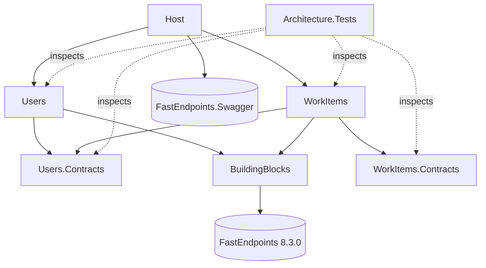

# Session 8afeacf8

_Auto-exported by save-transcript.mjs. Raw JSONL alongside._

---

## 🧑 Me


<pasted_content id="8051">
Read README.md and senior-backend-engineer/instructions.md, then CLAUDE.md.
Do not write any code yet.

1. Summarise the task as: must-have requirements, evaluation criteria, explicit non-goals,
   and submission deliverables (incl. ai-journey).
2. Identify every ambiguity or open design question yourself. Think about at least:
   username rules and uniqueness, whether the assignee must exist, behaviour of
   "list work items" for an unknown user, ID type, error/response contract, persistence.
3. Ask me about them with AskUserQuestion, max 4 per batch. For each question give 2–3 options
   with trade-offs and mark your recommended default.
4. After I answer, log each decision in ai-journey/decisions.md (AI proposed vs. final).
5. Finally, draft a short message I can send to the hiring contact with the 2–3 questions
   that genuinely need THEIR answer (not mine), stating the default I'll assume meanwhile.
</pasted_content id="8051">


**🤖 Claude:**


_tools: Bash_

**🤖 Claude:**


_tools: AskUserQuestion_

**🤖 Claude:**

The second batch covers technical choices.

**🤖 Claude:**


_tools: AskUserQuestion_

**🤖 Claude:**


_tools: Edit_

**🤖 Claude:**


_tools: Edit_

**🤖 Claude:**

I asked 8 open questions in two batches and you accepted my recommended option on all of them. Each one is logged in `ai-journey/decisions.md`, rows 1–8, with the options, my proposal and your final choice. None were overrides.

I also added a "Hiring contact message" section at the bottom of that file. When you send the message below, fill in the send date there, and later their answer. If they choose something other than my default, it goes under "Corrections". No code has been written.

## Draft message to the hiring contact

These are the three questions that are product or API behaviour rather than design choices. The other five (ID type, error format, persistence, CQRS library, tests) are yours to decide and explain in the README.

> **Subject:** Senior Backend take-home: 3 quick clarifying questions
>
> Hi [Name],
>
> I've started on the backend take-home. Before I go further, three questions about intended behaviour. I'll go ahead with the default in brackets for now, so there's no rush:
>
> 1. **Username uniqueness:** Should usernames be unique, and if so, case-insensitively ("Alice" and "alice" count as the same user)?
>    *(Default: unique and case-insensitive, 3–32 characters, letters/digits/`._-`.)*
> 2. **Assignee existence:** When creating a work item, should the service reject an assignee user ID that doesn't exist? Or are work items allowed to reference users that don't exist yet?
>    *(Default: reject it. The WorkItems module checks through the Users module's public contract.)*
> 3. **Listing for an unknown user:** When retrieving work items for a user ID that doesn't exist, should the API return an empty list or a 404?
>    *(Default: 200 with an empty list, so the read side doesn't depend on the Users module.)*
>
> Thanks!
> [Your name]

The next step is the architecture and solution-layout plan (projects, folders, how the contracts are wired). Shall I start that?

---

## 🧑 Me


<pasted_content id="8051">
Propose the architecture for this modular monolith. Do not write code.

Cover:
- Solution/project layout and the allowed project reference graph (draw it as a list or mermaid).
- Module boundaries: what each module's Contracts exposes, and how WorkItems validates an
  assignee without depending on Users internals. Compare a synchronous in-process contract
  vs. integration events + local read model.
- Domain model per module: aggregates, value objects, strongly-typed IDs, invariants, and
  where cross-aggregate rules (e.g. username uniqueness) live.
- CQRS: compare the FastEndpoints built-in command bus, the Mediator (source-generated) library,
  and MediatR (note its current licensing). Recommend one for this task and justify.
- Persistence: per-module store, in-memory option, and how it stays swappable.
- Request/response and error contract (status codes, validation, problem details).
- Testing strategy: domain unit tests, architecture tests for boundaries, a few endpoint
  integration tests. Name the libraries.
- Implementation order as vertical slices, each ending green.
- What we deliberately leave out (time box 2–4h).

For every major decision give 2 options + trade-offs + your recommendation.
Ask me (AskUserQuestion) about anything where reasonable seniors would disagree.
</pasted_content id="8051">


**🤖 Claude:**


_tools: Bash_

**🤖 Claude:**


_tools: Bash_

**🤖 Claude:**

Before I write the plan, these are the points where experienced engineers would reasonably disagree. First batch:

**🤖 Claude:**


_tools: AskUserQuestion_

**🤖 Claude:**

Second batch, covering the API surface and the internals of the read and write sides:

**🤖 Claude:**


_tools: AskUserQuestion_

**🤖 Claude:**


_tools: Edit_

**🤖 Claude:**


_tools: ToolSearch_

**🤖 Claude:**


_tools: EnterPlanMode_

**🤖 Claude:**


_tools: Write_

**🤖 Claude:**


_tools: Edit_

**🤖 Claude:**


_tools: ExitPlanMode_

**🤖 Claude:**

Approved. Saving it verbatim to `ai-journey/plan.md` as the working agreement requires:

**🤖 Claude:**


_tools: Bash_

**🤖 Claude:**


_tools: Bash_

**🤖 Claude:**

I've written up the architecture plan and you approved it. It's now appended word for word to `ai-journey/plan.md` as a section dated 2026-10-07. No code has been written yet.

**What the plan settles:**
- **Layout:** each module is two projects, a public `*.Contracts` project and one module project. Inside that project, Domain, Application, Infrastructure and Endpoints are folders, and everything is `internal`.
- **Cross-module check:** WorkItems asks Users whether an assignee exists through `IUserDirectory` in `Users.Contracts`. It passes a plain `Guid`, so no domain type crosses the boundary. WorkItems has its own `AssigneeId` value object.
- **CQRS:** FastEndpoints' built-in command bus, with our own `ICommand`/`IQuery` markers. An architecture test enforces the split.
- **Persistence:** EF Core in-memory, one DbContext per module. Writes go through repositories; reads query the DbContext directly.
- **HTTP:** errors are ProblemDetails: 400 for bad input, 404 not found, 409 duplicate username, 422 unknown assignee. Listing is `GET /work-items?assigneeId=`.
- **Build order:** 8 vertical slices, each ending with a green build and tests and a suggested commit message.

**Decisions:** you made 8 new ones (#9–#16) across two question batches and accepted my recommendation each time. They're in `ai-journey/decisions.md`, next to #1–#8 from the earlier phase.

**Things to know:**
- **The plan-snapshot hook saved nothing.** `ai-journey/plans/` was never created. `.claude/hooks/save-plan.mjs` reads `tool_input.plan`, but in this Claude Code version ExitPlanMode takes no input and reads the plan from a file instead, so the hook found nothing and quietly exited. One fix is to fall back to `tool_response`, or to read the newest file in `~/.claude/plans/`. Since that's your hook, I haven't touched it. Want me to patch it and back-fill `plans/01_*.md`?
- **.NET 8 support ends on 2026-11-10**, about a month from now. The stack is fixed, so I'll just mention it under "with more time" in the README. Building with SDK 10 for `net8.0` works, and the 8.0.30 runtime is installed.
- **Not yet confirmed in practice: whether FastEndpoints picks up `internal` endpoints and handlers.** Slice 0 checks this first. The plan has a fallback, and if it's needed I'll log it under Corrections.

The next step is slice 0, the solution skeleton plus the first architecture test. Shall I start?

---

## 🧑 Me

Append the approved plan to ai-journey/plan.md and log the decisions in ai-journey/decisions.md.

**🤖 Claude:**


_tools: Bash_

**🤖 Claude:**

Both were already done last turn, so I didn't append them again. One small fix: the "Where I overrode the AI" note only mentioned the requirements phase, so I've added the architecture phase to it.

**🤖 Claude:**


_tools: Edit_

**🤖 Claude:**

Both were already saved last turn, and I checked them again now:

- **`ai-journey/plan.md`**: the approved plan is in there once, as the section "2026-10-07 — Architecture plan (approved)". It's word for word the same as the approved plan file, apart from the title line and one blank line.
- **`ai-journey/decisions.md`**: all 16 decisions are logged, the 8 requirements decisions and the 8 architecture ones. Each row has the options, my recommendation, your final choice and whether you overrode me. You didn't override any.

The one new change is in the "Where I overrode the AI" note. It now covers both phases and says that #10 reopened the CQRS library choice (#7) once Mediator was compared, and the original pick stayed.

The plan-snapshot hook still isn't writing anything to `ai-journey/plans/`. Should I fix it and back-fill the snapshot of this plan, or move on to slice 0, the solution skeleton?

---

## 🧑 Me

fix the hook and back-fill the snapshot

**🤖 Claude:**


_tools: Bash_

**🤖 Claude:**


_tools: Bash_

**🤖 Claude:**


_tools: Bash_

**🤖 Claude:**

The ExitPlanMode result carries `{ plan, filePath }`, which the hook receives as `tool_response`. I'll update the hook to read it from there.

**🤖 Claude:**


_tools: Read_

**🤖 Claude:**


_tools: Edit_

**🤖 Claude:**

Now I'll test the fixed hook against the real ExitPlanMode payload from the transcript, writing into a scratch directory so nothing in the repo changes:

**🤖 Claude:**


_tools: Bash_

**🤖 Claude:**


_tools: Bash_

**🤖 Claude:**

Logging it under Corrections, as the honesty rule requires:

**🤖 Claude:**


_tools: Edit_

**🤖 Claude:**


_tools: Edit_

**🤖 Claude:**

I fixed the plan-snapshot hook and back-filled the missing snapshot as `ai-journey/plans/01_2026-10-07_2136.md`.

**The bug:** `.claude/hooks/save-plan.mjs` looked for the plan in `tool_input.plan`. In this Claude Code version (2.1.292), ExitPlanMode takes no input and returns the plan in its result (`tool_response`, with `plan` and `filePath`). The hook found nothing and exited without a word.

**The fix:** the hook now looks in three places, in order: `tool_input.plan`, `tool_response.plan`, then the file at `tool_response.filePath`. If none has a plan, it writes a warning to stderr instead of failing silently. It still always exits 0, so it can't block a session.

**How I tested it:** I replayed the real ExitPlanMode result from this session's transcript into the hook, writing to a scratch directory. The snapshot it produced matched the approved plan apart from a trailing newline. An empty payload gave the warning and exit 0. The real test is the next time a plan is approved, when a `02_*.md` should appear.

**The back-filled snapshot** was rebuilt from that same transcript record, so it's the exact approved text. It uses the hook's file-name format, but its header says it was back-filled and gives the original approval time, 21:36 local. That way it doesn't pretend the hook saved it.

**Logged as Correction #1** in `ai-journey/decisions.md`: what was wrong, how it was noticed, the fix and how it was checked.

Suggested commit message, if you want to commit this before slice 0 (I haven't committed):
```
fix(ai-journey): read approved plan from ExitPlanMode tool_response
```

---

## 🧑 Me


<pasted_content id="8051">
Implement step 1 of the plan only: solution, projects, project references, shared building
blocks, the host wired with FastEndpoints + Swagger, and an empty architecture-test project
with a first passing boundary test. Then fill in the Commands section of CLAUDE.md.
Run dotnet build and dotnet test. Stop and show me the project reference graph.
Suggest a commit message.
</pasted_content id="8051">


**🤖 Claude:**

Starting slice 0. First I'll check which package versions resolve for `net8.0`:

**🤖 Claude:**


_tools: Bash_

**🤖 Claude:**


_tools: Bash_

**🤖 Claude:**


_tools: Bash_

**🤖 Claude:**


_tools: Bash_

**🤖 Claude:**


_tools: Read_

**🤖 Claude:**


_tools: Bash_

**🤖 Claude:**

Now the build infrastructure. All projects target `net8.0` from one place, and package versions are managed centrally:

**🤖 Claude:**


_tools: Write_

**🤖 Claude:**


_tools: Write_

**🤖 Claude:**


_tools: Bash_

**🤖 Claude:**

Next, BuildingBlocks. I'll restore it first to confirm what `FastEndpoints.Messaging.Core` actually contains:

**🤖 Claude:**


_tools: Bash_

**🤖 Claude:**


_tools: Bash_

**🤖 Claude:**


_tools: Bash_

**🤖 Claude:**


_tools: Bash_

**🤖 Claude:**

I'll settle the exact API with a quick compile check in the scratch project:

**🤖 Claude:**


_tools: Bash_

**🤖 Claude:**


_tools: Bash_

**🤖 Claude:**

It compiles. Now I'll run it to see the response shape, and whether an `internal` endpoint gets discovered:

**🤖 Claude:**


_tools: Bash_

**🤖 Claude:**


_tools: Bash_

**🤖 Claude:**


_tools: Write_

**🤖 Claude:**


_tools: Write_

**🤖 Claude:**


_tools: Write_

**🤖 Claude:**


_tools: Write_

**🤖 Claude:**


_tools: Bash_

**🤖 Claude:**


_tools: Edit_

**🤖 Claude:**


_tools: Bash_

**🤖 Claude:**

BuildingBlocks builds, and `ValidationFailures` turned out to be accessible without the cast I'd used in the probe. Next, the four module projects and the Host:

**🤖 Claude:**


_tools: Bash_

**🤖 Claude:**


_tools: Write_

**🤖 Claude:**


_tools: Write_

**🤖 Claude:**


_tools: Write_

**🤖 Claude:**

Next, the architecture-test project:

**🤖 Claude:**


_tools: Bash_

**🤖 Claude:**


_tools: Write_

**🤖 Claude:**


_tools: Write_

**🤖 Claude:**

Now I'll create the solution and run build and tests:

**🤖 Claude:**


_tools: Bash_

**🤖 Claude:**


_tools: Bash_

**🤖 Claude:**


_tools: Bash_

**🤖 Claude:**

The test run printed nothing I could grep, so something went wrong. The revert itself is clean. I'll redo the check and show the full output:

**🤖 Claude:**


_tools: Bash_

**🤖 Claude:**

The project reference didn't get injected; the backslash escaping broke the replacement. I'll write the violating `.csproj` out in full instead:

**🤖 Claude:**


_tools: Bash_

**🤖 Claude:**


_tools: Bash_

**🤖 Claude:**


_tools: Bash_

**🤖 Claude:**


_tools: Edit_

**🤖 Claude:**


_tools: Bash_

**🤖 Claude:**


_tools: Bash_

**🤖 Claude:**

Slice 0 is in place and green. `dotnet build` gives 0 warnings and 0 errors (warnings count as errors), and `dotnet test` passes 6 of 6 architecture tests. Nothing has been committed.

## Project reference graph (read from the `.csproj` files)



This matches the approved plan. Only Host references the module implementation projects, WorkItems reaches Users only through `Users.Contracts`, and both Contracts projects have no dependencies.

## What was built
- **Build setup:** `Directory.Build.props` sets `net8.0`, nullable and warnings-as-errors for every project. `Directory.Packages.props` holds all package versions in one place. `JTL-BE.sln` is the classic `.sln` format; SDK 10 would otherwise create `.slnx`.
- **BuildingBlocks:**
  - `Result<T>` and `Error` (Validation / NotFound / Conflict / Unprocessable).
  - The `ICommand`/`IQuery` and handler markers over FastEndpoints' command bus.
  - `Send.SendErrorAsync(error)`, which turns an `Error` into a 400/404/409/422 problem-details response.
- **Modules:** each has an empty implementation project with a public `AddXModule()`, plus an empty Contracts project.
- **Host:** FastEndpoints scans only the module assemblies it's given, uses problem-details errors with error codes, and serves Swagger.
- **Architecture tests:** 3 rules, each run for both modules:
  - a module never references another module's implementation assembly;
  - a module's types never use another module's internal namespaces;
  - Contracts projects reference no module implementation.

## Checks beyond "it's green"
- **The tests can fail.** I temporarily made WorkItems reference the Users implementation and use a `Users.Domain` type. Two rules failed and named the offender (`WorkItems.Violation`). I then reverted, and all 6 pass again.
- **Internal endpoint discovery, the plan's open risk, works.** A temporary `internal` endpoint inside the Users assembly answered 200 and appeared in Swagger, so endpoints and handlers can stay `internal`. I removed it afterwards.
- **Error shape.** A throwaway check showed 404, 409 and 422 all come back as `application/problem+json` in the same shape as FastEndpoints' own binding errors.

## Worth knowing
- **`dotnet run` fails right now.** FastEndpoints throws `unable to find any endpoint declarations` when there are zero endpoints. That goes away with slice 1's first endpoint. I didn't add a placeholder endpoint to work around it, and CLAUDE.md notes the behaviour.
- **I created only `Architecture.Tests`.** You asked for that one; the plan's slice 0 listed all four test projects. `Users.Tests`, `WorkItems.Tests` and `Api.Tests` will arrive with the slices that put code in them.
- **BuildingBlocks depends on full FastEndpoints**, not the lighter `Messaging.Core`, because the error helper needs FastEndpoints' response sender. Domain and application code only touch the `Results` and `Cqrs` namespaces; a later architecture test will enforce that.
- **CLAUDE.md "Commands" is filled in:** build, test, architecture-only tests, run with the Swagger URL, the zero-endpoint caveat, a layout summary, and the two places a new module must be registered. I also added `.vs/` and `TestResults/` to `.gitignore`.

## Suggested commits
The hook fix from earlier is still uncommitted too, so I'd split them:
```
fix(ai-journey): read approved plan from ExitPlanMode tool_response
```
```
chore: scaffold modular monolith skeleton with boundary tests

- net8.0 solution with central package management, warnings as errors
- BuildingBlocks: Result/Error, CQRS markers over FastEndpoints bus,
  Error -> problem-details mapping
- Users/WorkItems modules (implementation + Contracts), Host with
  explicit module assembly scanning and Swagger
- Architecture.Tests: module-boundary rules (NetArchTest)
```

Next is slice 1, the Users create-user flow. I'll stop here as you asked.

---

## 🧑 Me


<pasted_content id="8051">
Implement slice "Users: CreateUser" from ai-journey/plan.md.

Order: domain → application → endpoint → tests.
- Domain: User aggregate with a private constructor and a factory method, a strongly-typed
  UserId, and a Username value object that enforces the rules we decided in decisions.md
  (validation, normalisation). No public setters.
- Application: CreateUserCommand + handler. Username uniqueness lives where the plan says;
  the command returns only the new id.
- Persistence: the Users module's own store behind an interface owned by the module.
- Endpoint: POST, thin — map request → command → response. Validation errors and domain
  errors map to the error contract we agreed (problem details / status codes).
- Tests: unit tests for Username and User invariants; one endpoint integration test
  (happy path + duplicate/invalid username).

Before writing code, list any decision this slice needs that the plan doesn't cover and ask me.
When done: run dotnet build and dotnet test, show a short summary of files added, tell me
what you deliberately did NOT do, and suggest a commit message.
</pasted_content id="8051">


**🤖 Claude:**

Before writing any code, here's what this slice needs that the plan doesn't settle.

I'll decide these myself as implementation details and flag them in the summary:
- **Error codes:** `users.username.required`, `…invalid_length`, `…invalid_characters`, `…taken`.
- **EF mapping of `Username`:** an owned type with two columns, `Value` (as entered) and `NormalizedValue` (with a unique index). The uniqueness query compares `NormalizedValue`.
- **Test isolation:** each host gets its own `InMemoryDatabaseRoot` singleton. EF otherwise shares in-memory databases with the same name across `WebApplicationFactory` instances. This avoids any test-only overrides.
- **Missing or null `username` in the body:** goes through the value object and comes back as a 400 `users.username.required`. No FluentValidation duplicates.

These three are genuinely open, so I'm asking:

**🤖 Claude:**


_tools: AskUserQuestion_

**🤖 Claude:**

Logging the three decisions first:

**🤖 Claude:**


_tools: Edit_

**🤖 Claude:**


_tools: Bash_

**🤖 Claude:**


_tools: Bash_

**🤖 Claude:**


_tools: Bash_

**🤖 Claude:**

Unexpected: most of these files are now tracked. Checking the history:

**🤖 Claude:**


_tools: Bash_

**🤖 Claude:**


_tools: Edit_

**🤖 Claude:**


_tools: Edit_

**🤖 Claude:**

Now the slice itself. First, package versions:

**🤖 Claude:**


_tools: Bash_

**🤖 Claude:**

Before writing the endpoint, I'll confirm two FastEndpoints API details: how to send a response with a status code, and how handlers are constructed:

**🤖 Claude:**


_tools: Bash_

**🤖 Claude:**

I'll use `ResponseAsync(response, 201)` with a literal Location header, per decision #18. `CreatedAtAsync` needs the GET endpoint, which arrives in slice 2. Now the domain layer:

**🤖 Claude:**


_tools: Write_

**🤖 Claude:**


_tools: Write_

**🤖 Claude:**


_tools: Write_

**🤖 Claude:**


_tools: Write_

**🤖 Claude:**


_tools: Write_

**🤖 Claude:**

Application layer:

**🤖 Claude:**


_tools: Write_

**🤖 Claude:**


_tools: Write_

**🤖 Claude:**

Infrastructure, meaning the module's own store:

**🤖 Claude:**


_tools: Write_

**🤖 Claude:**


_tools: Write_

**🤖 Claude:**


_tools: Write_

**🤖 Claude:**


_tools: Write_

**🤖 Claude:**

Then the endpoint:

**🤖 Claude:**


_tools: Write_

**🤖 Claude:**


_tools: Bash_

**🤖 Claude:**


_tools: Bash_

**🤖 Claude:**

The build is green. Now the tests. First the unit-test project for the domain:

**🤖 Claude:**


_tools: Bash_

**🤖 Claude:**


_tools: Write_

**🤖 Claude:**


_tools: Write_

**🤖 Claude:**


_tools: Write_

**🤖 Claude:**


_tools: Bash_

**🤖 Claude:**

All green on the first run: 6 architecture, 19 domain and 5 API tests. Committing per the updated CLAUDE.md rule, including the ai-journey changes:

**🤖 Claude:**


_tools: Bash_

**🤖 Claude:**

The CreateUser slice is done and committed as `ef5413b`. `dotnet build` is clean (warnings count as errors) and `dotnet test` passes all 30 tests: 6 architecture, 19 domain and 5 API.

One thing to know first: before writing code I asked how slice 0 should be committed, without re-checking git. You'd already committed it as `c8ef295`. I left your commit alone, updated decision #17 to say so, and logged it as Correction #2. Decisions #18 (Location header) and #19 (EF Core 8) went as recommended.

## Files added (Users module + tests)
| Layer | Files | What it does |
|---|---|---|
| Domain | `UserId`, `Username`, `User`, `UserErrors`, `IUserRepository` | `Username` trims input, allows 3–32 characters of `[a-zA-Z0-9._-]`, and treats "Alice" and "alice" as equal. `User` has a private constructor, a `Create` factory and private setters. The repository interface belongs to the domain. |
| Application | `CreateUser/CreateUserCommand`, `CreateUserHandler` | Returns `Result<Guid>`, the id only. The uniqueness check lives in the handler (decision #12). |
| Infrastructure | `UsersDbContext`, `UserConfiguration`, `UserRepository` | The module's own EF Core 8 in-memory store. The schema is `users`, and the username is stored as entered plus a normalized column with a unique index. |
| Endpoint | `Endpoints/CreateUser/CreateUserEndpoint` | `POST /users` maps request → command → response, with no other logic. It returns 201 with `{ id }` and `Location: /users/{id}`, or a 400/409 problem-details response with an error code. |
| Composition | `UsersModule` | Registers the DbContext and the repository. Each host gets its own in-memory store. |
| Tests | `Users.Tests` (UsernameTests, UserTests), `Api.Tests` (CreateUserEndpointTests) | Edge cases at 3 and 32 characters, trimming, case-insensitive equality, no public setters. The endpoint test covers 201 + Location, 409 for the same name in different case, and 400 for too short, bad characters and missing. |

Two choices not in the plan:
- I added the `Microsoft.EntityFrameworkCore.Relational` package. The in-memory provider has no schema, table or index configuration, so this is needed for the schema-per-module metadata the plan asks for. It only adds metadata.
- Each host gets its own in-memory store. Otherwise EF shares same-named in-memory databases across test hosts in one process.

## Deliberately not done
- **Not race-safe on duplicate usernames.** The in-memory store ignores the unique index, so two simultaneous requests could both succeed. This is documented in the code; on SQL the index closes the gap.
- **Nothing beyond create-user yet:** no `GET /users/{id}` (slice 2), no `IUserDirectory` (slice 3), and no `CreatedAtAsync`. The Location header is a fixed string until slice 2.
- **No FluentValidation validators** (decision #13) and no handler unit test: the endpoint test covers the handler from end to end.
- **No layering or CQRS architecture rules** yet, such as "the domain must not use EF" (slice 6). The module-boundary tests still pass.
- **No error-path test for the request body itself:** a malformed JSON body hits FastEndpoints' own binding errors, which I haven't tested.

## Commit
```
ef5413b feat(users): create user
```
It includes the ai-journey updates: decisions #17–#19 and Correction #2. Session transcripts get refreshed at the end of each turn, so the latest one will go in with the next commit.

Next is slice 2, `GET /users/{id}`, which also switches the Location header over to `CreatedAtAsync`.

---

## 🧑 Me


<pasted_content id="8051">
Implement slice "Users: GetUserById" from ai-journey/plan.md.

- Query: GetUserByIdQuery + handler returning a read model/DTO, never the aggregate.
  The query must not change state.
- Decide with me (if not already in decisions.md) whether the query side reads through the
  repository or a separate read path, and why — keep it consistent with the plan.
- Endpoint: GET by id, thin; 404 for unknown id, 400 for malformed id.
- Tests: handler unit test or endpoint integration test for found / not found.

Check that the command and query sides of the Users module now follow the same conventions
(naming, folder layout, result/error handling). Point out any inconsistency before fixing it.
Run build + tests, summarise, suggest a commit message.
</pasted_content id="8051">


**🤖 Claude:**

The read-path question is already settled: decision #14 says reads use the DbContext directly with `AsNoTracking` and DTO projections. But implementing it exposes a contradiction in my own plan, and checking the Users module for consistency turned up two more things.

**Inconsistencies found (nothing fixed yet):**
1. **The plan contradicts itself.** §5 says query handlers read the `UsersDbContext` directly. §1 says Application must not depend on Infrastructure, where `UsersDbContext` lives. Applied literally, a query handler in `Application/` breaks the planned layering rule. That's my mistake, and it goes under Corrections.
2. **`Error` factory signatures don't match each other.** `Error.Validation(field, code, message)` puts the field first, but `Error.Conflict(code, message, field?)` and `Error.Unprocessable(code, message, field?)` put it last. That's easy to get wrong at a call site.
3. **Where errors live.** `UserErrors` sits in `Domain/` and mixes value-object errors with `UsernameTaken`, a rule the application layer enforces. The new `UserNotFound` would add another application-level error.
4. **Location header.** `CreateUserEndpoint` still builds a fixed `/users/{id}` string. That's already decided (#18); I'll switch it to `CreatedAtAsync` in this slice.

**🤖 Claude:**


_tools: AskUserQuestion_

**🤖 Claude:**


_tools: Bash_

**🤖 Claude:**

Logging the decisions and the plan correction:

**🤖 Claude:**


_tools: Edit_

**🤖 Claude:**


_tools: Edit_

**🤖 Claude:**

Now the consistency fixes. First the `Error` factories (#21) and the catalog (#22):

**🤖 Claude:**


_tools: Edit_

**🤖 Claude:**


_tools: Edit_

**🤖 Claude:**


_tools: Write_

**🤖 Claude:**

Now the query side. The query, handler, DTO and read-store port sit together in `Application/GetUserById/`, matching `Application/CreateUser/`:

**🤖 Claude:**


_tools: Write_

**🤖 Claude:**


_tools: Write_

**🤖 Claude:**


_tools: Write_

**🤖 Claude:**


_tools: Write_

**🤖 Claude:**


_tools: Write_

**🤖 Claude:**

Next, wire the read store, and switch CreateUser to a Location header built from the real route (decision #18):

**🤖 Claude:**


_tools: Edit_

**🤖 Claude:**


_tools: Edit_

**🤖 Claude:**


_tools: Edit_

**🤖 Claude:**


_tools: Edit_

**🤖 Claude:**

Now the tests. The problem-details assertions would otherwise be copied into a second test class, so I'm moving them into one shared helper:

**🤖 Claude:**


_tools: Write_

**🤖 Claude:**


_tools: Write_

**🤖 Claude:**


_tools: Write_

**🤖 Claude:**


_tools: Write_

**🤖 Claude:**


_tools: Bash_

**🤖 Claude:**

All green: 19 domain, 6 architecture and 9 API tests. Before committing, one last pass comparing the two sides of the Users module:

**🤖 Claude:**


_tools: Bash_

**🤖 Claude:**

The two sides line up: every type is `internal` except `UsersModule`, and each use case has matching `Application/<UseCase>/` and `Endpoints/<UseCase>/` folders. Committing:

**🤖 Claude:**


_tools: Bash_

**🤖 Claude:**

`GET /users/{id}` is in and committed as `f6f8f58`. `dotnet build` is clean (warnings count as errors), and all 34 tests pass: 19 domain, 6 architecture, 9 API.

## Read path: my plan contradicted itself
How reads work was already decided (#14: reads skip the aggregate repository and use no-tracking projections). But my approved plan also said query handlers read `UsersDbContext` directly while forbidding Application from depending on Infrastructure, which is where `UsersDbContext` lives. Followed literally, the first query handler would have broken the planned layering rule.

You chose a read-store port (decision #20). `IUserReadStore` is an interface in `Application/GetUserById/` that returns a `UserDto`. `UserReadStore` in Infrastructure implements it with a no-tracking query that selects only the needed columns. The aggregate repository stays write-only, so the read/write split from #14 holds. I logged the plan error as Correction #3; `plan.md` itself is left as written.

## Inconsistencies I raised, and what was done
| # | Finding | Outcome |
|---|---|---|
| 1 | Plan's read side vs its layering rule | Fixed with the read-store port (#20) |
| 2 | `Error.Validation` took the field first; `Conflict`/`Unprocessable` took it last | All factories are now `(code, message, field)` (#21) |
| 3 | `UserErrors` in Domain holds errors the application layer detects | Kept as the module's single list of error codes; `NotFound` added there (#22) |
| 4 | POST's Location was a hard-coded string | Now `CreatedAtAsync<GetUserByIdEndpoint>`, built from the GET route (#18) |

After the slice I checked again. Both use cases now share the same shape:
- Folders: `Application/<UseCase>/{Message, Handler}` and `Endpoints/<UseCase>/`.
- Messages carry plain values (`string?`, `Guid`); value objects are built inside the handler.
- Handlers return `Result<T>` with errors from `UserErrors`.
- Endpoints share the same failure branch, `Send.SendErrorAsync(result.Error)`.
- Every type is `internal` except `UsersModule`.

## Added in this slice
- **Application:** `GetUserByIdQuery` with `UserDto`, `GetUserByIdHandler`, `IUserReadStore`.
- **Infrastructure and wiring:** `UserReadStore`, registered in `UsersModule`.
- **Endpoint:** `GET /users/{id}` returns 200 `{ id, username }`, 404 with code `users.not_found`, or 400 for a malformed id. There's deliberately no `{id:guid}` route constraint, because with one a bad id would come back as a 404 instead of a 400.
- **Tests:**
  - Found: the username comes back exactly as entered.
  - The POST response's Location header leads back to the created user.
  - 404 for an unknown id, 400 for a malformed one.
  - The problem-details assertion and a `CreateUserAsync` helper are now shared test code rather than copies.

## Deliberately not done
- **No handler unit test for the query.** The handler is two lines, and the API tests cover found and not-found end to end, plus the malformed-id 400 that a handler test can't reach.
- **No architecture test yet proving queries don't change state**, for example "query handlers don't use `IUserRepository`" or "Application doesn't use EF Core". Today that rests on code review plus the no-tracking projection; plan slice 6 adds the rules.
- **No `IUserDirectory` cross-module contract**; that's slice 3.

## Commit
```
f6f8f58 feat(users): get user by id
```
It includes the ai-journey updates: decisions #20–#22 and Correction #3.

The next slice exposes the `IUserDirectory` contract for WorkItems.
